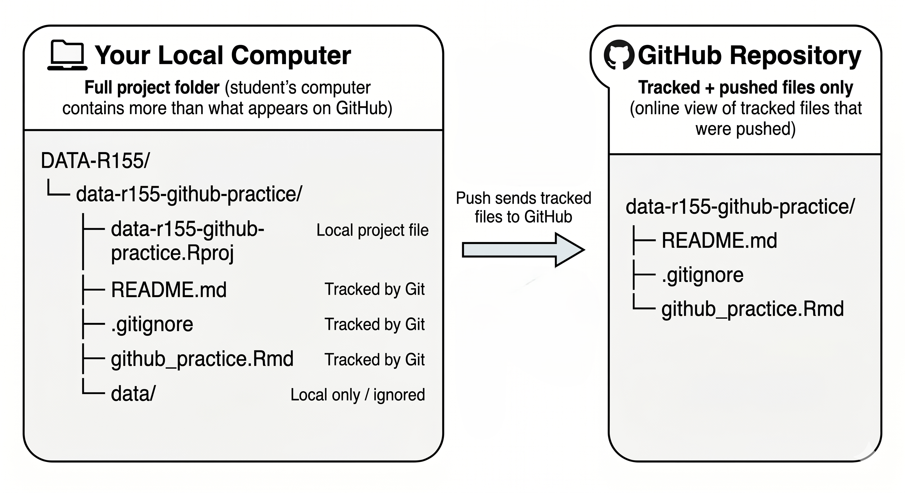
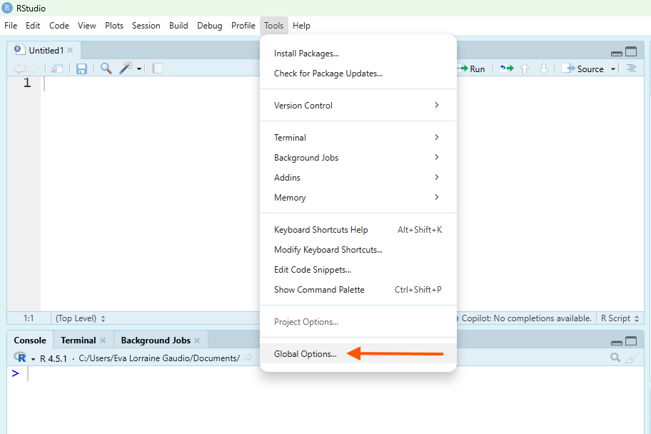
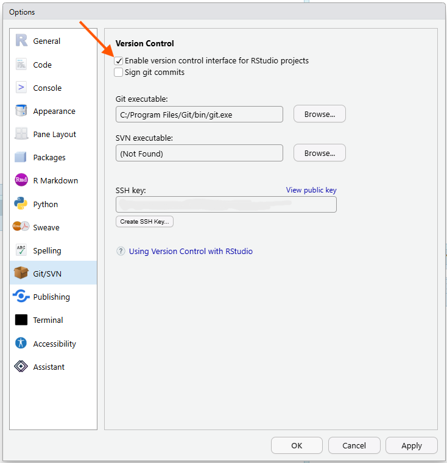
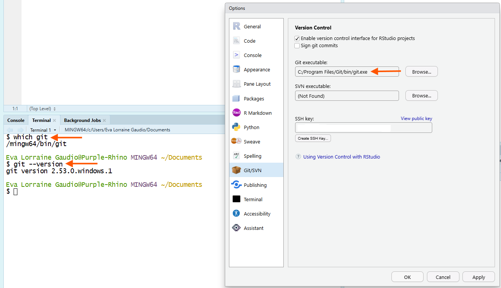

```{r setup, include=FALSE}
knitr::opts_chunk$set(echo = TRUE)
```


# Overview

In this guided activity, you will connect GitHub, Git, and RStudio so they can work together. You will create a small GitHub repository, clone it into RStudio as a project, make changes locally, commit those changes, push them to GitHub, and practice pulling a change back down from GitHub.

You are not expected to learn how to write Git commands from memory. RStudio provides a beginner-friendly way to use Git, but its built-in Git tools are limited, so learning Git commands is necessary to take full advantage of Git. Git can be confusing at first, so the chapter keeps things simple, allows practical low-tech workarounds when useful, and recommends storing files over GitHub’s size limits elsewhere with links in the project documentation.

By the end of this activity, you will 

- 🐙 have a working GitHub repository that proves your setup works.

- 🐙 understand the relationship between GitHub, Git, and RStudio.

- 🐙 know the workflow: Pull, Edit, Commit, and Push.

## What You Will Create

- You will create one public GitHub repository named: `data-r155-github-practice`.

- Your final repository should include:

```
data-r155-github-practice/
  README.md
  .gitignore
  github_practice.Rmd
```

- Your local project folder will look more like this:

```
DATA-R155/
  data-r155-github-practice/
    data-r155-github-practice.Rproj
    README.md
    .gitignore
    github_practice.Rmd
    data/
```



Figure 1 shows the folder structure this activity guides you to build for both your local computer and your GitHub Repository. Your computer has the full working project folder. 

GitHub only shows the files that Git is tracking and that you push online. This structure protects confidential data in the `data/` folder from being uploaded to GitHub. The .`gitignore` file tells Git which files or folders to ignore when committing changes, such as the `data/` folder.

The `README.md` file is a markdown file that serves as the landing page for your GitHub repository.  

The `github_practice.Rmd` file is an R Markdown document where you will practice editing, committing, and pushing changes to GitHub. 


---

## GitHub, Git, and RStudio

**GitHub** is the online place where your repository lives. **Git** is the version-control tool that tracks changes. RStudio is where you will edit your files and use the Git pane to commit and push your work.

You are using three connected locations:

| Place           | What it means                                | What you do there                            |
| --------------- | -------------------------------------------- | -------------------------------------------- |
| GitHub.com      | The online copy of your project              | Create the repository and verify pushed work |
| Your computer   | The local copy of your project folder        | Store and organize files                     |
| RStudio Project | The R working space connected to that folder | Edit files, commit changes, pull, and push   |


> GitHub is the online copy. Your computer has the local copy. RStudio helps you work inside the local project folder.


Optional reading: [Git, GitHub and how repositories work](https://docs.github.com/en/get-started/using-git/about-git){target="_blank" rel="noopener noreferrer"}

---

### Version Control

**Version control** means tracking changes to files over time. Instead of saving files with names like `final`, `final2`, and `REALLY_FINAL`, Git lets you save meaningful checkpoints called **commits**.

Each commit has a short message explaining what changed.

🎯 As you work today, your goal is to create several commits that show your workflow:

1. Edit the README from RStudio.
2. Ignore the local data/ folder.
3. Add an R Markdown practice file.
4. Practice pulling from GitHub and pushing from RStudio.
5. Complete the final evidence checklist.

✅ Verify you understand that a commit is a checkpoint, not just a file save.

🗣 Saving a file updates the file on your computer. Committing records a version-control checkpoint. Pushing sends that checkpoint to GitHub.


Optional reading: [More about Version Control](https://git-scm.com/book/en/v2/Getting-Started-About-Version-Control){target="_blank" rel="noopener noreferrer"}

### Steup Order

GitHub setup is difficult for novice coders because skipping one small step can break the setup. Just like when you are writing R code, GitHub setup order includes a verification step. Verify each action was successful before moving on. Do not skip ahead. If you complete tasks out of order, you may have to start over. 

🎯 Complete the setup in this order:

1. Install or verify you have Git.
2. Configure your Git identity.
3. Check that RStudio can find Git.
4. Create a GitHub account and Log into GitHub.
5. Create and store a Personal Access Token.
6. Create a GitHub repository.
7. Clone that repository into RStudio.
8. Practice pull, edit, commit, and push.


💡 **Tip**: If something does not work, and you're stuck, use the course support options to get help. You can do hard things!

---

# GitHub Account


Register for free GitHub Account

The first step is to Register a GitHub Account.

Your username tips:

- short, 

- professional, 

- memorable, 

- timeless, 

- all lower case, 

- separate words with a hyphen “-” or underscore “_” if needed.

## Configure SSH keys

Connecting Tools

Personal Access Token (PAT)

OR

SSH Keys

PATs are convenient but easily compromised.

SSH Keys never leave your machine, allow for more control and provides better security, but are more challenging to set up. 

 for creating an SSH key.

### Setup SSH 

**SSH keys**: two long strings of characters used to authenticate a user’s identity when connecting to a remote server. 
Generate these keys on your local computer using an SSH utility.

1. From the shell: `ssh-keygen -t rsa -b 4096`

2. Follow prompts to create your keys. By default, they’ll be saved in `~/.ssh/id_rsa` (private key) and `~/.ssh/id_rsa.pub` (public key).

3. Add your public key to GitHub

a. Go to settings > SSH and GPG keys

b. Click “New SSH key”

c. Copy public key into key field

d. Give device a title

4. Test Connection

a. From the shell: `ssh -T git@github.com`

1. Randomness and Key Generation:

- The ssh-keygen command generates an RSA key pair (consisting of a private key and a public key).

- The process starts by creating a random seed (using entropy sources like keyboard timings and mouse movements).

- This randomness is essential for security.

2. Mathematical Algorithms:

- The RSA algorithm is used to create the key pair.

3. The **private key** must remain confidential and secure. It is used for authentication.

4. You Never Share Your Private Key


# Update R and RStudio

R and RStudio are updated frequently. From time to time, when you open RStudio, you will be notified in a pop up window that you need to download the latest versions installed. Having the most up-to-date version will ensure compatibility with Git and GitHub. 💡 **Tip**: It is good practice to always update R or RStudio when prompted. Outdated versions of R can result is incompatibilities with downloaded packages, Git and GitHub. 

[Download R and RStudio at https://posit.co/download/rstudio-desktop/](https://posit.co/download/rstudio-desktop/){target="_blank" rel="noopener noreferrer"}


# Git Installation

As you are beginning to understand, **Git** is the tool that tracks file changes. RStudio can use Git, but Git must be installed on your computer first. 

## Version Control Enabled

Git tools appear after version control is enabled for an RStudio Project.

🎯 From the Tools menu, click Global Options



Figure 2 shows the drop down list from selecting "Tools." An orange arrow is pointing at Global Options. Select Global Options to open the Global Options window.

🗣 This opens the Global Options window. On the left side of the window is a list of options.

🎯 Click on the Git/SVN tab



In Figure 3, the Git/SVN option is highlighted. An orange arrow is pointing at the check box for "Enable version control interface for RStudio projects." Make sure this box is checked in your RStudio. Click Apply and Ok to save changes.

## Install Git

First, check whether Git is already installed by opening the Terminal in RStudio or your operating system and typing `git --version`. This is common for Mac and Linux users. Windows users usually need to install Git.

### Check for Git

Method A.

In RStudio, you can check if Git is installed by going to Tools > Global Options > Git/SVN. If Git is installed, you will see the path to the Git executable. If not, you will see a message that says "Git executable not found."

Method B.

Additionally, you can check for Git in the terminal by typing `which git` and that will show you where Git is installed on your system. You can type `git --version` to check the version of Git installed. 

💡 **Tip:** Git is sensitive to command syntax and spelling, so type commands carefully.



In Figure 4, the Git/SVN option window in Global Options shows the path to the Git executable as well, confirming that Git is installed and recognized by RStudio. The Terminal pane shows the command `which git` and the output is `/mingw64/bin/git`, which indicates that Git is installed and located at that path. Your path will likely be different, but the key is that it shows a path to Git rather than an error message. The `git --version` command also shows the version of Git installed. If Git is not installed, it will return an error message, such as `git: command not found`.

🎯 Type `git --version` in the terminal to check if Git is installed.

```bash
git --version
```


If git is not installed, you will need to install it before you can use GitHub with RStudio. Follow the instructions below to install Git on your operating system. If Git is already installed, you can skip to the next section to configure your Git identity.

### Install Git

Installation depends on your operating system: Windows users should install Git for Windows/Git Bash, Mac users should download and install Git, and Linux users can install Git through their package manager.

If you found that you do not have Git installed, navigate to the section that describes how to install Git for your operating system. 

### macOS: Xcode command line tools

1. Go to the shell and enter one of these commands to elicit an offer to install developer command line tools:

```bash
git --version
git config
```

2. Accept the offer, click install

OR

[git scm mac](http://git-scm.com/downloads){target="_blank" rel="noopener noreferrer"}

1. Download Xcode from the App Store

2. Use “Terminal” app on Mac for next step

### Linux: distro’s package manager

1. Ubuntu or Debian Linux: sudo apt-get install git

2. Fedora or RedHat Linux: sudo yum install git

OR

[git scm (linux)](https://git-scm.com/download/linux){target="_blank" rel="noopener noreferrer"}


### Windows: Git Bash

🎯 Install Git if it is not already installed.

[Instructor Demonstration Video. Watch an RStudio Update and Git install on a Windows computer.](https://boisestate.hosted.panopto.com/Panopto/Pages/Viewer.aspx?id=21199429-d002-49ac-be8b-b3fa0017c302){target="_blank" rel="noopener noreferrer"}

[Link to Download Git for Windows](https://git-scm.com/install/windows){target="_blank" rel="noopener noreferrer"}

1. Accept the defaults

2. RStudio for Windows prefers for Git to be installed below C:/Program Files

    C:/Program Files/Git/bin/git.exe
    
💡 **Tip:** Keep the default installation path to ensure RStudio can find Git.
    
### After Installation

🎯 In RStudio, go to the Terminal tab and type:

```bash
git --version
```

✅ Verify you see a Git version number. See Figure 4 for more details. If you see a version number, Git is installed. If you see an error, Git is not installed correctly yet or RStudio cannot find it. Without Git installed, you cannot progress forward with the activity. Reach out

💡**Tip:** After installing Git, you may need to restart RStudio before RStudio recognizes it.

---

Now that we all have Git installed, we need to configure our Git identity.

## Introduce yourself to Git

Your **Git identity** means the name and email Git attaches to your commits. This does not write code for you. It labels your work.


🎯 Click the Terminal tab in the bottom left pane (next to the Console). "Introduce" yourself to Git in the Terminal typing in the following commands, replacing the name and email with your own. 💡**Tip:** Use the email associated with your GitHub account. 


```bash
git config --global user.name "Your Name"
git config --global user.email "example@u.boisestate.edu"
```

✅ Verify you see your u`ser.name `and u`ser.email.`

```bash    
git config --global --list
```

Initial default branch

  git config --global init.defaultBranch main

GitHub has “main” as the default initial branch 


# Part 2

Prove local Git can talk to GitHub

1. Make a Repo on GitHub

2. Clone the Repo in Shell

3. Make a local change

## Make a Repo on GitHub

1. Go to  and make sure you are logged in.

2. Near “Repositories”, click the big green “New” button. 

3. Repository template: No template

4. Repository name: myrepo

5. Description: “My first repo”

6. Public

7. Initialize: Add a README file

8. Click green “Create repository”

9. In Local tab, select HTTPS SSH

10. Copy

## Clone Repo in Shell

1. Paste Copied: 

    git clone https://github.com/YOUR-USERNAME/YOUR-REPOSITORY.git

2. Make working directory

    cd myrepo
    ls
    head README.md
    git remote show origin

## Make a local change

1. Add line to README


    echo "A line I wrote on my local computer  " >> README.md
    git status


2. Send to GitHub

    git add README.md
    git commit -m "A commit from my local computer"
    git push
    
💡 **Tip:**When finished, delete folder corresponding to the local repo

    cd ..
    rm -rf myrepo/


# Part 3

Connecting Tools: Connect RStudio to GitHub

Prove RStudio can talk to GitHub

1. Make a repo on GitHub

2. Clone GitHub via RStudio

3. Make Local changes, save and commit

4. Confirm the local change in GitHub

## Make a repo on GitHub

1. Go to  and make sure you are logged in.

2. Near “Repositories”, click the big green “New” button. 

3. Repository template: No template

4. Repository name: `myrepo`

5. Description: “My second repo”

6. Public

7. Initialize: Add a README file

8. Click green “Create repository”

9. In Local tab, select HTTPS SSH

10. Copy repository URL

## Clone GitHub via RStudio

Start a new project

1. File > New Project > Version Control > Git

2. Paste repository URL

3. Accept the default (project name and GitHub repo name must match)

4. PAY ATTENTION to where you are saving your project locally

5. Open in a new session

6. Create Project

7. Notice the README.md file on your computer

## Local changes

1. Open README.md in RStudio

2. Add line to README

    “A line I wrote in RStudio"

3. Commit

a. Click Git tab

b. Check “Staged” box for README.md

c. Click “Commit”

d. Type message “Commit from R”

e. Click Commit

4. Push

5. Confirm in GitHub

# Part 4

Workflow

"it’s fairly easy to screw up your local Git repository, especially when you’re new at this."
"Your life is much easier if this is baked into your workflow"

"If you’ve recently pushed your work to GitHub, it’s easy to grab a fresh copy, patch things up with the changes that only exist locally, and get on with your life."


## Create a R Markdown Document

File > New File > R Markdown

1. Make sure your project is open

2. Give it an informative title (Spaces and Punctuation)

3. Output format of HTML (Can change later)

4. Save “first.rmd” in RStudio project folder (Do not nest in folder)

No need to set a working directory again!

## Edit the R Markdown Document

1. Add some text and code

2. Save

3. Commit 

4. Push to GitHub

## Data Folder Structure

Covers:

1.. Minimum viable structure (what you described): keep the data in the same folder as the R Notebook so relative paths are simple.

2. Best practice structure: create a `data/` folder and move raw files into it:

-`Intro_to_R/`
-- `chapter9_notes.Rmd`
-- `data/`
--- `myfile.csv`
--- `myfile.xlsx`

Introduce RStudio Projects: a way to keep everything together and keep a stable working directory.

### Privacy and Github

Covers (short, concrete):

- Why `data/` exists: so later you can ignore it when you start using GitHub.

- The mechanism they’ll use later: a .gitignore can exclude folders like `data/` from commits.

- A simple rule of thumb:

1. OK to upload: public/open data, de-identified data you’re allowed to share

2. Do not upload: human-subjects data, protected/controlled data, anything you promised to keep private


gitignore: a file that tells Git which files or folders to ignore when committing changes. This is useful for keeping sensitive data or large files out of your GitHub repository.

In Chapter 7, you learned to store data in the same folder as your R Notebook. This is the minimum viable structure for a project, but it can get messy as you add more files. A better practice is to create a `data/` folder and move your raw data files into it. This way, your project folder stays organized, and you can easily manage your data files.

Your structure becomes:

-`Intro_to_R/`
-- `chapter9_notes.Rmd`
-- `data/`
--- `myfile.csv`
--- `myfile.xlsx`

**🎯 Goal** Store your data in a `data/` folder then check 

```{r}
# Check your R notebook's working directory files
list.files()
list.files("data")
```

🗣 After moving the files into data/, you must include the `data/` in the file path.

# Summary


# Chapter Terms


**Commit**: A saved checkpoint in Git that records a specific set of file changes with a message describing what changed. In this course, a commit is the version-control equivalent of saying, “save this meaningful stage of my work.”

**data/** Folder: A project folder used to store dataset files separately from scripts, notebooks, and output files. Keeping data in a dedicated folder makes file paths clearer, keeps the project organized, and helps others find the raw or prepared data needed to reproduce the analysis. The data/ directory is also a common convention in R project structures.

**Git**: A version-control tool that tracks changes to files over time so you can save snapshots, review what changed, and return to earlier versions if needed. Git records the history of your R project files on your computer. 

**Git Identity**: The name and email address that Git attaches to each commit to show who authored the work. Your Git identity is set with `user.name` and `user.email`; it labels your commits so the project history shows who made each checkpoint.

**GitHub**: An online platform for storing and sharing Git repositories. GitHub is the web-based location where your repository lives, while Git tracks changes locally and RStudio provides the Git pane you use to commit and push your work. 

**.gitignore**: A plain-text file that tells Git which files or folders not to track or commit, such as temporary files, system files, rendered outputs, or large/private data files. A .gitignore file is usually placed in the root of a repository so the ignore rules apply consistently across the project.

**Pull**: Updating your local project with changes from the remote repository on GitHub. Pull before you start working so your RStudio project has the newest files before you edit, commit, and push. Technically, `git pull` fetches remote changes and merges them into your current local branch.

**Push**: Sending your local commits from your computer to the remote repository on GitHub. Pushing is how the work you committed in RStudio becomes visible in your online GitHub repository.

**README.md**: A Markdown file that explains what a repository contains and how to use it. On GitHub, the README is usually the first file people see when they open a repository, so it should provide key orientation such as the project purpose, file structure, setup steps, and important notes.

**Version Control**: A system for tracking changes to files over time so you can review earlier versions, understand what changed, and return to a previous checkpoint if needed. In Git, these meaningful checkpoints are called commits, which are better than saving files with names like `final`, `final2`, or `REALLY_FINAL`. 


# 📝 Practice Space

## Task 1

## Task 2

# References


