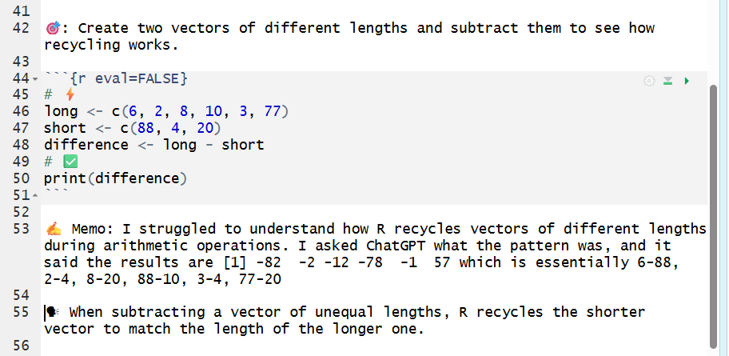

```{r setup, include=FALSE}
knitr::opts_chunk$set(echo = TRUE)
```

```{r eval=FALSE, include=FALSE}
title: "Chapter 3"
subtitle: "Vector Basics"
author: "by Lorraine Gaudio"
date:   "`r paste('Version', format(Sys.Date(), '%B %d, %Y'))`"
output: 
  pdf_document:
    toc: true
    toc_depth: 2
    number_sections: true
    citation_package: natbib
    fig_caption: true
    df_print: kable # Data frame printing
    includes:
      in_header: ../assets/header.tex
    latex_engine: xelatex  # Use xelatex to support fontspec
fontsize: 12pt
geometry: margin=1in
mainfont: "Garamond" # Sets the font of the entire document
sansfont: "Gotham-Book.otf" # Set sans-serif font to Gotham Book
monofont: "Courier New" # Set monospace font to Courier New
documentclass: scrreprt
linkcolor: boisestateblue # Customizes the color of hyperlinks
urlcolor: magenta # Customizes the color of URLs
citecolor: black # Customizes the color of citations
bibliography: references.bib # Bibliography file
biblio-style: apalike                 # ⟵ natbib needs a .bst style
natbiboptions: "round,authoryear"     # round brackets, Author (Year)
# ---
title: "Chapter 3"
subtitle: "📏 Vector"
author: "by Lorraine Gaudio"
date:   "`r paste('Version', format(Sys.Date(), '%B %d, %Y'))`"
team: "Summer 2026"
output: 
  html_document: # To create an HTML document from R Markdown
    toc: false # Table of contents (TOC)
    toc_depth: 1 #(meaning that level 1, 2, and 3 headers will be included in the table of contents
    toc_float: # Float the table of contents to the left of the main document
      collapsed: false # Collapsed (defaults to TRUE) controls whether the TOC appears with only the top-level
      smooth_scroll: true # controls whether page scrolls are animated when TOC items are navigated to via mouse clicks.
    number_sections: true # Numbering starts with "#" (H1). Without H1 headers, the H2 headers ("##") will be numbered with 0.1, 0.2, and so on.
    css: ../assets/styles.css # This is the name of the CSS file to style the HTML document with Boise State Brand. The CSS file must be in the same directory as the R Markdown file.
    fig_caption: true #Whether figures are rendered with captions.
    df_print: paged # Printing data frames with interactivne scrolling
    includes:
      in_header: ../assets/header.html
      after_body: ../assets/footer.html
```

# Overview

Up to this point, you’ve been writing code in the Console and saving your work in R Scripts. In this chapter, you switch into an R Notebook (`.Rmd`): one document that combines your writing, your code, and the output produced by that code. This matters for research because the goal is not just to “get an answer,” but to leave a record that another person (or future-you) can follow, audit, and rerun. In other words, the notebook is your first step toward reproducible work.

You’ll also learn what “good memoing” looks like in a notebook. Instead of burying your thinking in # comments, you can write short paragraphs between chunks that explain what you tried, what happened, and what you changed. That is a research skill: it reduces mistakes, makes debugging faster, and makes your work defensible when someone asks, “How did you get that result?”

Finally, you’ll start building “vector metadata” skills—how to check what R thinks your object is—because R will often run code even when your object is the wrong type. You will practice checking class/type and working with character strings (quotes + paste) so you stop fighting avoidable errors. You’ll close with logical vectors, which are the foundation for filtering and decision-making later (even before you formally learn data frames).

By the end of Chapter 3, you should be able to start a notebook correctly, write clear memos, and diagnose basic object types—skills you will rely on immediately as the course moves toward real data and reproducible analysis.

In Chapter Three you will learn how to:

- 📝 Write and save R Notebooks.

- 📍 Run code from a code chunk.

- 🧮 Perform arithmetic operations on numeric vectors.

- 🔄 Use recycling to perform operations on vectors of different lengths.

- 🏷️ Identify what kind of data an object is using `class()`

- 📎 Combine strings of words with the `paste()` function.

- 🔗 Add elements to vectors.

- 🛠 Build logical vectors.

# R Notebooks—Part 1

An **R Notebook** is an **R Markdown** (.Rmd) document where you can run code in code chunks and immediately see the output *directly below the chunk*. The utility is reproducible thinking: your code, your results, and your memo-style notes live in one place, in order, so someone else (including future-you) can follow what happened.

R Notebooks are similar to R Scripts but offer additional features such as:

- **Interactive Code Execution**: You can run code chunks individually and see the output immediately below the chunk.

- **Rich Text Formatting**: You can use Markdown to format text, add headings, lists, links, and images.

- **Output Display**: The output of code chunks, including plots and tables, is displayed directly in the notebook.

- **Reproducibility**: R Notebooks support reproducible research by allowing you to combine code and narrative in a single document.

## R Script vs R Notebook

In this course, the key advantage of an R Notebook over an R Script is memoing. A script can hold code + `#` comments, but an R Notebook is built for writing full memos (regular text) between code chunks without turning everything into comments. This supports a reproducible workflow (Course Objective CLO1).


| Feature                     | R Script                          | R Notebook                        |
|-----------------------------|----------------------------------|-----------------------------------|
| File Extension              | .R                               | .Rmd                              |
| Code Execution              | Run entire script or line-by-line| Run individual code chunks        |
| Output Display              | Console only                     | Output displayed below code chunks|
| Text Formatting             | Comments only (`#`)              | Full Markdown support             |
| Memoing                     | Limited to comments              | Full memos with text and code     |

## Open a New R Notebook

To open an R Notebook, you will need to install the `rmarkdown` package and then create a new R Notebook file in RStudio.

### Step 0: Install the rmarkdown package

To use R Notebooks, you need the `rmarkdown` package. A **package** is an installable bundle of tools—functions, documentation, and sometimes data—that extends what R can do. Most packages are downloaded from CRAN (the main public repository for R packages).

Method A. **File Pane**

1. In RStudio, go to the `Packages` tab in the bottom-right `Files` pane.

2. Click on 📥 `Install`.

3. In the dialog box that appears, type `rmarkdown` in the `Packages` field.

4. Make sure Install dependencies is checked.

5. Click `Install`.

🗣 If installation succeeds, you should see messages in the Console showing what was installed.

Method B. **Console Pane**

1. In RStudio, go to the `Console` pane (bottom-left).

2. Type the following command and press Enter:

```{r , eval=FALSE}
install.packages("rmarkdown")
```

```{r, eval=FALSE}
# Using one of the methods above, 
# install the rmarkdown package
#After installation, confirm  
packageVersion("rmarkdown")
```

### Step 1: Open an R Notebook

To create an R Notebook in RStudio:

1. Go to `File` > `New File` > `R Notebook`.

2. An .Rmd file opens in the Source pane.

💡 **Tip:** If your RStudio version does not show “R Notebook,” choose R Markdown… and select HTML Notebook as the output format. The end result is still an R Notebook stored as an `.Rmd` file.

📖  For more information on R Notebooks, refer to the [Documentation on R Notebooks](https://bookdown.org/yihui/rmarkdown/notebook.html).

## The YAML Header

At the very top of your notebook you will see a block that looks like this:

```yaml
---
title: "Untitled"
output: html_notebook
---
```

This is called the **YAML header** (pronounced “YAM-ul”). It is document metadata—settings that control the notebook’s title and output type. Think of it as the document’s “front label,” not code. 

### Renaming the Notebook

🎯 Edit the title of the notebook to match the assignment

```yaml
---
title: "Chapter 3 Practice"
output: html_notebook
---
```

### Saving the Notebook

🎯 To save your R Notebook:

1. Go to `File` > `Save As...`.

2. Choose your course folder (e.g., `Intro_to_R`)

3. Name the file `chapter3_notes`.

4. Note that the file extension is `.Rmd`.

✅ Verify you can see `chapter3_notes.Rmd` in the **Files** pane.

## Code Chunks

A **code chunk** is a fenced block where R code runs. It begins with three backticks plus `{r}` and ends with three backticks: <code>&#96;&#96;&#96;{r}</code> … <code>&#96;&#96;&#96;</code>.


<code>&#96;&#96;&#96;{r}</code>

\# your R code

<code>&#96;&#96;&#96;</code>

### Inserting Code Chunks

Method A. **Toolbar Button**

Click the green C button and select R from the drop down list. 


Method B. **Keyboard Shortcut**

Press `Ctrl + Alt + I` (Windows/Linux) or `Cmd + Option + I` (macOS).

Method C. **Manually Type**

Type the following lines in your R Notebook:

    ```{r}
    # Your R code goes here
    ```
    
*The "r" should have curly braces `{ }` around it.*  

## Run Code Chunks

Like so many things in R, there are several ways you can run code chunks. 

Method A. **Run Menu**

Click the `Run` menu at the top of RStudio and select `Run Current Chunk` or `Run All Chunks`.


Method B. **Play Button**

Clicking the green play button (▶) at the top-right of the chunk 


Method C. **Keyboard Shortcut**

Placing your cursor inside the chunk and pressing `Ctrl + Shift + Enter` (Windows/Linux) or `Cmd + Shift + Enter` (macOS).

### Example: Vector Arithmetic

🎯 Insert a code chunk then type and run the following R code to do vector arithmetic. 

```{r}
# ⚡ Type this in your R Notebook
x <- c(2, 4, 6)
y <- c(1, 3, 5)

x + y
```


🎯 Click the green play button in the chunk (top-right of the chunk), or use the Run menu to run the current chunk / all chunks.

🗣 There is an output below the code chunk that shows the result of adding the two vectors element-wise: (2 + 1 = 3; 4 + 3 = 7; 6 + 5 = 11).


```{r}
#  ⚡ Type this in your R Notebook
x * 2
x / y
```

🗣 When including two calculations in the same code chunk, both results are shown in order below the code chunk. 

**Vectorization** is when R applies an operation to each element of a vector. In the example above, R adds the corresponding elements of vectors `x` and `y` together element-by-element.

As you practice R programming in the R Notebook, you will want to keep a record of your learning process. Memoing is a lot easier in R Notebooks than in R Scripts. 

For more information on R Markdown code chunks, refer to the [R Notebook documentation](https://bookdown.org/yihui/rmarkdown/notebook.html#using-notebooks).

# Memoing in R Notebooks

The code chunk is like a mini R Script. Inside a code chunk, memo text must start with # or R will try to run it as code (and may error). Treat # like a “do not execute” marker for the computer.

Text outside code chunks is normal writing. It does not need # because it is not code.

That is the main reason we use Markdown in this course is so you can write memos that are readable paragraphs (not a wall of # comments).

🎯 Click on a blank line outside the chunk and type something like:

- 🎯 Goal: Practice creating vectors and doing arithmetic.

- ✅ Verify: I should see three outputs: x + y, x * 2, and x - y.

- ✍ Memo: Document your learning process. What you discover, your challenges ,etc. 

- 🗣 Explain: Vector math happens element-by-element, so the first result adds the first elements together, then the second, then the third.

___

💬 How does this look in a practice?

🧩 **Memo Example**


🧐 **Notice:** The student (1) ✍️ kept but commented out (`#`) the code with the errors, (2) ✍️ copied the error shown in the console and pasted it below the code chunk, (3) 🗣 composed memos that identified the issues (a typo with a comma, using an object before it was created, and case sensitivity), and (4) ⚡ revised the code to fix the errors. 

___

Now that you can write code in code chunks and memos in regular text, practice recycling vectors while keeping a transparent research journal.

### Example: Recycling Vectors

When you perform arithmetic on two vectors of different lengths, R will "recycle" the shorter one to match the longer one.

🎯 Create a new vector named `recycled_result` by adding the `combination` vector to the `numbers3` vector.

```{r}
# ⚡ Type this in your R Notebook
numbers3 <- c(1.5, 2.5, -3.5)
combination <- c(1, 2, 3, 4, 5)
recycled_result <- numbers3 + combination
```

⚠️ A **Warning** message may appear indicating that the longer vector length is not a multiple of the shorter vector length. This is expected behavior in R when recycling occurs. Warning messages do not stop code execution but serve as alerts to potential issues.

```{r , eval=FALSE}
# ✅ Check the recycled_result vector
print(recycled_result)
```

🗣 R recycles the `numbers3` vector (1.5, 2.5, -3.5) to match the length of the `combination` vector (1, 2, 3, 4, 5). The addition is performed element-wise.

___

🧩 **Memo Example**

 

🧐 **Notice:** The student 👀 cited the specific AI tool used to help her deepen her understanding and 🗣 explained the final results in her own words.

___

Learning to use an AI tool is part of becoming a modern researcher. However, it is essential to use these tools ethically and transparently, as discussed in more detail in the next chapter.

Next, let's explore how R uses metadata to determine how to treat different types of vectors.

# Vector Metadata

In this section you will learn how **class** affects how R interprets an object and decides how it should behave.

## Class and behavior

Recall from chapter 2 that vectors are collections of elements *of one underlying type*. We used `mode()` to check the type of elements in a vector. Some vectors also carry a class attribute that changes how R treats them. Classes are built on top of types. `class()` reports the attribute that controls *how* R treats an object and which methods to use when functions are applied to it. It is the semantic type of the object, what the vector is considered to be. The class of an object affects printing, method selection, and how many functions behave. 

For example, an object created with `as.Date()` has the class "Date," which tells R to treat it as a date, even though its underlying mode is numeric.

🎯 Store the current date in a variable named `today` using the `as.Date()` function, then check its type with `mode()` and class with the `class()` functions.

```{r, eval=FALSE}
# ⚡ Type this in your R Notebook
today <- as.Date("2026-01-01")

mode(today)

class(today)
```

🗣 The object `today` is "numeric" in type but has the class "Date." 

So what? Even though numeric is the underneath type, it doesn't mean that R will treat it like a number.

🎯 What date will it be in one week?

```{r, eval=FALSE}
# ⚡ Type this in your R Notebook
today + 7
```

🗣 The value 7 was added to the day part of the date. 

## Types vs Classes

Every object has an underlying type; some objects also have a class attribute that changes behavior. So far, you've seen numeric, integer, and character underlying types. `class()` often matches the underlying type label. 

**Common Atomic Vector Types:**

- **double**: numeric numbers (e.g., `1`, `3.14`)

- **integer**: whole numbers (e.g., `1L`, `2L`)

- **character**: text strings (e.g., `"Hello World", "R is fun"`)

- **logical**: `TRUE` or `FALSE` values

- **complex**: complex numbers (e.g., `1 + 2i`)

- **list**: a collection of objects (e.g., `list(a = 1, b = "text")`)

**Classes built on top of types:**

- **numeric**: includes both double and integer types (e.g., `42`, `3.14`)

- **Date**: dates (e.g., `as.Date("2026-01-01")`)

- **factor**: categorical data (e.g., `"red"`, `"blue"`) is
  a special type of character vector used for categorical data.
  
- **matrix**: a two-dimensional array (e.g., `matrix(1:6, nrow = 2)`)

- **array**: a multi-dimensional array (e.g., `array(1:12, dim = c(2, 3, 2))`)

- **data.frame**: a table-like structure (e.g., `data.frame(name = c("Alice", "Bob"), age = c(25, 30))`)

## Character strings

A **character string** is a sequence of characters enclosed in quotes. They are used to represent text data in R.

The `paste()` function in R is used to concatenate (combine) strings together. It takes multiple string arguments and combines them into a single string, with an optional separator between them.

___

🧩 **Memo Example**


🧐 **Notice:** The student (1) 🗣 composed a memo expressing confusion about the term "character." This is a great opportunity to research. Being actively engaged with your learning is a human-centered mindset. This student could review the course materials, ask a peer or the instructor.

___


`paste()` works across vectors too, combining elements element-wise.

🎯 Create two character vectors named `first_names` and `last_names`, then use the `paste()` function to combine them into a new vector named `full_names`.

```{r , eval=FALSE}
# ⚡ Type this in your R Notebook
first_names <- c("Demi", "Snoop", "Ed")
last_names <- c("Moore", "Dogg", "Sheeran")
full_names <- paste(first_names, last_names)
```

```{r , eval=FALSE}
# ✅ Check the full_names vector
print(full_names)
```

🗣 The output shows the full names created by combining the first and last names element-wise.

💡 **Tip:**: If you don't want spaces, try `paste0()`.

## Factor Vectors (Categorical Data)

A **factor** is R’s way of storing categorical data. These values that come from a fixed set of categories (for example: "freshman", "sophomore", "junior", "senior"). Factors are common in data analysis because they help R treat categories correctly in tables, summaries, and models.

A factor often looks like a character vector, but it is not the same thing. In fact, object *type* will sometimes surprise you!

### Creating Factors

The function `factor()` is used to create factor vectors from character vectors.

📜 The SYNTAX (basic): 

`factor(x = character())`

🎯 Create a factor vector named `grades` that contains the following letter grades: "A", "B", "C", "A", "B", "A" using the `factor()` function.

```{r , eval=FALSE}
# ⚡ Type this in your R Notebook
grades <- c("A", "B", "C", "A", "B", "A")
grades <- factor(grades)
```

🗣 The object `grades` is overwritten as a factor using the `factor()` function because the same name is used in the assignment process `grades <-`.

```{r , eval=FALSE}
# ✅ Check the grades factor
mode(grades)
class(grades)
print(grades)
```

🗣 The output shows that the `grades` object is of type "numeric" and class "factor." The printed output displays the levels of the factor, which are the unique categories present in the vector.

### Levels and Ordering

Even though the elements are text strings, the underlying type is stored as integer. Specifically, `mode()` often reports numeric while `typeof()` reports the precise storage type as integer. **Levels** are the distinct categories a factor can take, ordered in a specific way. By default, R usually orders factor levels alphabetically. You can override this default ordering by specifying the levels when creating the factor.

🎯 Create a factor vector named `sizes` with levels ordered as "Small," "Medium," and "Large" using the `factor()` function.

```{r , eval=FALSE}
# ⚡ Type this in your R Notebook
sizes <- c("Medium", "Large", "Small", "Medium", "Large")
sizes <- factor(sizes, levels = c("Small", "Medium", "Large"))
```

```{r , eval=FALSE}
# ✅ Check the sizes factor
print(sizes)
```

🗣 The output shows the `sizes` factor with levels ordered as "Small," "Medium," and "Large," as specified in the `factor()` function.

___

**🧩 Memo Example**


🧐 **Notice:** The student (1) ✅ confirmed the original object’s class (character) and then created a factor version, (2) 🔎 checked multiple diagnostics (mode(), typeof(), and levels()) to investigate what changed, (3) ✍️ wrote a memo that pinpointed the exact contradiction (“stored as numbers but prints words”) instead of hand-waving, and (4) 🤖 used an AI tool to research the mechanism and then summarized the explanation accurately in their own words (integer codes + levels labels).

This is a high-quality memo because it captures confusion, gathers diagnostic evidence, and then resolves the confusion with a correct explanation. 

___


Another type of attribute that vectors can have is names. Let's look at named vectors more closely.

### Data Coercion

A atomic vector means that all elements must be of the same type. If you try to mix types, R will coerce (convert) them to a common type based on a hierarchy of flexibility.

🎯  What happens if you mix numbers and characters?

```{r , eval=FALSE}
# ⚡ Type this in your R Notebook
mixed <- c("candy", 4, "book", 92)
# ✅ Check the mixed vector
class(mixed)            # character: all elements coerced to character
```

🗣 A vector can only hold *one* type. Mixing types triggers *coercion* to the most flexible type (logical → numeric → character).


#### Converting Between Types

You can explicitly convert between types using functions like `as.numeric()`, `as.character()`, and `as.logical()`. 

The `as.numeric()` function tries to convert characters to numbers. If it can't, it returns `NA` (not available).

📜 The SYNTAX (basic): 

`as.numeric(x)`


🎯 Try converting a character vector of numbers to numeric using the `as.numeric()` function.

```{r , eval=FALSE}
as.numeric(c("1", "2", "3")) # character → numeric: text converts to numbers
```

🗣 The output shows the numeric values 1, 2, and 3 successfully converted from character strings.


🎯 Try converting the `mixed` vector to numeric using the `as.numeric()` function.

```{r , eval=FALSE}
# ⚡ Type this in your R Notebook
as.numeric(mixed)            # character → numeric: text converts to NA
```

🗣 The output shows `NA` for the character elements "candy" and "book" because they cannot be converted to numeric values. The numeric elements 4 and 92 are successfully converted.


## Indexing Vectors

The **indexing operator** `[` is the standard way to extract (or replace) parts of a vector. The basic pattern is `x[i]`, where `x` is the vector and `i` is the index (or indices) of the elements you want to extract. The `[` operator can select one element or many and it returns an object of the same type as `x`. 

A position used to identify elements in an object. In R, indices are typically integers (positions), names (characters), or logical values (TRUE/FALSE).

### Positonal Indexing

🎯 **Goal**  Using `[ ]` with index positions on vectors. 

```{r}
# ⚡ Type this in your R Notebook
z <- c(10, 20, 30, 40, 50) # create a vector
```


```{r}
# ⚡ Type this in your R Notebook
z[1]       
```

🗣 The first element by position

```{r}
# ⚡ Type this in your R Notebook
z[3]      
```

🗣 The third element by position

```{r}
# ⚡ Type this in your R Notebook
z[2:4]     
```

🗣 The second, third and fourth elements by position

```{r}
# ⚡ Type this in your R Notebook
z[-c(1, 5)] 
```

🗣 All **except** first and last elements


### Character Indexing

When a vector has names, you can use those names to index into the vector. **Character indexing** uses the names of the elements to retrieve specific values.

🎯 Use character indexing to return the hexadecimal color code for "Octarine."

```{r , eval=FALSE}
# Create nerdy_palette
nerdy_palette <- c(
  "Octarine" = "#7F00FF",
  "TARDIS Blue" = "#003B6F",
  "Rebeccapurple" = "#663399",
  "Hooloovoo" = "#4F97A3",
  "Cosmic Latte" = "#FFF8E7",
  "Vantablack" = "#000000",
  "Matrix Green" = "#03A062",
  "Source Engine Magenta" = "#FF00FF",
  "Command Red" = "#CC0000",
  "Impossible Green" = "#4D9E68"
)

# Use character indexing to return the hex code for Octarine
nerdy_palette["Octarine"]
```

🗣 The output shows the hexadecimal color code for "Octarine" retrieved from the `nerdy_palette` vector using its name.

Character indexing required exact matching on names. If you ask for a name that doesn’t exist, you get NA for that element.

🎯 Use character indexing to retrieve the color codes for "Octarine," "TARDIS Blue," and "NotAColor" from the `nerdy_palette` vector.

```{r , eval=FALSE}
# ⚡ Type this in your R Notebook
nerdy_palette[c("Octarine", "TARDIS Blue", "NotAColor")]
```

🗣 The output shows the hexadecimal color codes for "Octarine" and "TARDIS Blue," and `NA` for "NotAColor," which does not exist in the `nerdy_palette` vector.

### More Indexing by Position

**Positional indexing** uses the numeric positions of elements in the vector to retrieve specific values. 

🎯 Use positional indexing to return the first and third color codes from the `nerdy_palette` vector.

```{r , eval=FALSE}
# ⚡ Type this in your R Notebook
nerdy_palette[c(1, 3)]
``` 

🗣 The output shows the hexadecimal color codes for Octarine and Rebeccapurple in the `nerdy_palette` vector.

We will return to indexing in later chapters when we learn about data frames.

# Logical Vectors

___
**REVIEW**

**Logical vectors** are used for conditions and comparisons. They contain TRUE or FALSE values.

🎯 Create a logical vector named `real` that contains the values TRUE, FALSE, and NA using the `c()` function.

```{r , eval=FALSE}
# ⚡ Type this in your R Notebook
real <- c(FALSE, TRUE, TRUE, FALSE, TRUE, TRUE, TRUE, TRUE, TRUE, NA)
```
```{r , eval=FALSE}
# ✅ Check the real vector
print(real)
```

🗣 The output shows the logical values stored in the `real` vector.
___

## Comparison Operators

Logical vectors can also be created using comparison operators. These operators compare values and return TRUE or FALSE based on the comparison.

**Logical operators** include:

- `>` greater than

- `<` less than

- `==` equal to

- `>=` greater than or equal to

- `<=` less than or equal to

- `!=` not equal to

🎯 Create a logical vector named `logicals` that contains the results of the following comparisons: `1 > 2`, `3 < 5`, and `4 == 4` using the `c()` function.

```{r , eval=FALSE}
# ⚡ Type this in your R Notebook
logicals <- c(1 > 2, 3 < 5, 4 == 4) 
```

```{r , eval=FALSE}
# ✅ Check the logicals vector
print(logicals)
```

🗣 The output shows the results of the comparisons stored in the `logicals` vector. There is one FALSE value and two TRUE values. The first value is FALSE because 1 is not greater than 2. The second value is TRUE because 3 is less than 5. The final value is TRUE because 4 is equal to 4.

# Summary

In this chapter, you learned to create an R Notebook (`.Rmd`), rename and save it correctly, and use code chunks to run R code with output shown directly beneath your work. You also practiced memoing in a notebook by writing short, clear notes about what you tried, what happened, and what you changed. Finally, you strengthened core “vector metadata” skills by checking what R thinks your objects are (for example, using `class()` and related checks), working with character strings (quotes + `paste()`), and building logical vectors with comparison operators (`>`, `<`, `==`, `!=`) to produce TRUE/FALSE results.

# Chapter Terms

**Backtick**: The &#96; character (above the Tab key) used for code-related formatting and quoting. In **Markdown**, single backticks mark *inline code* and triple backticks create *fenced code blocks*; in **R Markdown**, backticks also mark *inline R code* (<code>&#96;r ...&#96;</code>), including inside YAML fields like <code>date: "&#96;r Sys.Date()&#96;"</code>, which gets evaluated when you render the document. In R, backticks can also quote non-syntactic names (e.g., names with spaces) so they can be used safely in code.

**Character Indexing**: Indexing a named vector using element names (character strings) instead of numbers. Names must match exactly; a missing name returns `NA`.

**Character String**: A single piece of text in R, stored as a character value and written in quotes (for example, "My favorite color is yellow!" or "Who stole the cookie from the cookie jar?"). 

**Class** `class()`: A function that reports the object’s class, which tells R how to interpret the object and which methods to use when functions are applied to it. For example, `class(3.14)` returns `"numeric"`, and `class(mtcars)` returns `"data.frame"`.

**Code Chunks**: Fenced blocks in an R Markdown/Notebook document where R code is written and executed, usually starting with ```{r}. Only code inside a chunk runs, and its output (including plots and tables) appears directly below the chunk when executed.

**Element Names**: The individual labels assigned to elements inside a named vector (for example, `"Octarine"` or `"TARDIS Blue"`). Element names let you index by label (e.g., `nerdy_palette["Octarine"]`) to retrieve specific values.

**Factor Class**: An R object class for categorical data, where each value is stored as an integer code that points to a category label. Factors help R handle categories correctly in tables, plots, and statistical models, even though they may print like text.

**Factor Levels**: The distinct category labels a factor can take (for example, `"freshman"`, `"sophomore"`, `"junior"`, `"senior"`). Levels define the set and order of categories, and each factor value is internally stored as the index of its level.

**Honesty**: Accurately reporting what you did in R—your actual steps, mistakes, revisions, and uncertainty—without presenting outside work as your own. This includes clearly attributing code, ideas, and any AI assistance, and being able to explain the code you submit.

**Indexing Operator**: The square-bracket indexing operator `[` or `[[` are used to extract or replace parts of an object in R (for example, `x[i]`). For vectors, it selects one or more elements and returns the same kind of object as `x` (a vector).

**Logical Operators**: Operators that create or combine logical elements. The most common are comparison operators—`==`, `!=`, `<`, `>`, `<=`, `>=`—which return `TRUE`/`FALSE`, and Boolean operators—`!` (NOT), `&` / `|` (AND/OR applied element-by-element), and `&&` / `||` (AND/OR that evaluate only the first element, mainly for if conditions).

**Logical Vector**: A vector that stores Boolean elements: `TRUE` or `FALSE` (and sometimes `NA` for missing). Logical vectors are commonly produced by comparisons (for example, `x > 0`) and are heavily used for filtering and conditional code

**NA**: A special constant that marks a missing value (“Not Available”)—meaning the data point is unknown or not recorded. R also provides typed missing values like `NA_integer_`, `NA_real_`, `NA_character_`, and `NA_complex_` to match the underlying data type.

**Named Vectors**: Vectors that have labels attached to their elements via the `names()` attribute, so you can refer to values by name instead of only by position. Named vectors are useful as simple lookup tables (for example, retrieving a hex code by a color name).

**Object Name**: The variable name you assign with `<-` that refers to the entire object in your environment. You use the object name to print, modify, or pass the whole object to functions.

**Openness**: Making your analysis inspectable and reproducible by sharing the inputs and decisions that produced your results (data source, packages, code, and key assumptions). In this course, openness means you provide others with enough details so thay are able to rerun your work and get the same outputs.

**Package**: An installable collection of R code—functions, documentation, and sometimes datasets—that adds new features beyond base R. Packages are commonly installed from CRAN and then loaded with `library()` so you can use their tools in your session.

**Positional Indexing**: Indexing a vector using numeric positions (for example, `x[1]` for the first element or `x[c(1, 3)]` for the first and third). Positions are based on the current order of the vector.

**R Markdown**: A document format (`.Rmd`) that mixes plain-text writing (Markdown) with embedded R code chunks, so you can generate reports that combine narrative, code, and computed output. You can render an R Markdown file into finished formats like HTML, PDF, or Word.

**R Notebook**: An `.Rmd` (R Markdown) document that lets you run code in chunks and see the results (output, tables, plots) immediately below each chunk. It’s designed for reproducible work because it keeps your code, results, and explanatory notes together in the same file.

**Research Journal**: A running record of your R analysis process. This inlcudes what question you asked, what code you tried (including failed attempts), what outputs you got, and what decisions you made along the way. In practice, it’s maintained in an R script or R Markdown/Notebook with dated notes, comments, and citations so you (or someone else) can retrace, verify, and reproduce the work.

**Transparency**: The practice of clearly disclosing your methods, materials, assumptions, tools, values, and sources so another person can follow your workflow, reproduce your results, and evaluate your claims. In this course, transparency supports explanatory power (you can explain what your code does and why) and originality/accountability (you produce and attribute work honestly, including documenting if and how you used AI).

**Vectorization**: R’s behavior of applying a function to an entire vector at once, producing results element-by-element without writing an explicit loop. For example, `paste(first, last)` combines the first elements together, then the second, then the third, returning a vector of full names.

**YAML Header**: The metadata section at the top of an R Markdown or Quarto document, written between `---` lines, that controls document settings like the title, author, date, output format (HTML/PDF/Word), and options for rendering.

# 📝 Practice Space

Fill in the blanks to complete the code. 

Before you begin, make sure you have created a new R Notebook in the Source pane and saved it as `chapter3_practice.Rmd` in your course folder. 

Remember to document your **tenacity** on a memo if you encounter any errors while completing the tasks.

R Notebooks can look “fine” even when they are not reproducible because your Environment may still contain objects from earlier work. Start with a clean environment and run everything in order.


## Task 1

🛠 **Build numeric vectors**

🎯 Build two numeric vectors where both vectors are the same length.

1.  Create a vector called `sales_q1` with FOUR numbers of your choice.

```{r eval=FALSE}
# ⚡ Type this in your R Notebook, Fill in the blanks
sales_q1 <- c(___, ___, ___, ___)
```

2.  Create a vector called `sales_q2` with FOUR numbers of your choice.

```{r eval=FALSE}
# ⚡ Type this in your R Notebook, Fill in the blanks
sales_q2 <- c(___, ___, ___, ___)
```

```{r , eval=FALSE}
# ✅ Check the sales_q1 and sales_q2
print(___)
___(sales_q2)

length(___)
___(sales_q2)
```

🗣 Add Comment:  # The output shows __________

## Task 2

📈 **Vector arithmetic**

Using vector arithmetic, create an object named `growth` that stores the difference between `sales_q2` and `sales_q1`.

```{r , eval=FALSE}
# ⚡ Type this in your R Notebook, Fill in the blanks
growth <- ______ _ ______
```

```{r , eval=FALSE}
# ✅ Check the growth vector
print(growth)
```

🗣 Add Comment:  # The output shows __________


## Task 3

🔢 **Exponents and vectorized math**

🎯 Create a numeric vector named `binary_powers` that contains the powers of $2$ from $2^0$ to $2^10$ using the `^` operator and the `exponents` vector.

```{r , eval=FALSE}
# ⚡ Type this in your R Notebook, Fill in the blanks
exponents <- __:__
__________ <- 2__exponents
```

```{r , eval=FALSE}
# ✅ Check the length binary_powers vector
_____(binary_powers)
```

🗣 Add Comment:  # The output shows ___ elements (values) in the `binary_powers`

## Task 4

📈 **Vector arithmetic**

🎯 Find the `anomaly` by subtracting the `cursed_seq` vector from the `travel_jumps` vector. We'll recreate vectors seen in Chapter 2 and then subtract them.

```{r , eval=FALSE}
# ⚡ Type this in your R Notebook
cursed_seq <- c(4L, 8L, 15L, 16L, 23L, 42L)          # Integer via c()
``` 

```{r , eval=FALSE}
# ⚡ Type this in your R Notebook
travel_jumps <- seq(from = 1887, to = 2052, by = 33)   # numeric via seq()
```


```{r , eval=FALSE}
# ⚡ Type this in your R Notebook, Fill in the blanks
anomaly <- __________ - __________
```

```{r , eval=FALSE}
# ✅ Check the anomaly vector
print(anomaly)
```

🗣 Add Comment:  # The output shows __________

## Task 5

🎯 **Step 1: Sweep your Environment (start clean).**  
Click the 🧹 **broom icon** in the Environment pane to clear objects.

🎯 **Step 2: Run everything top-to-bottom.**  
Use **Run → Run All** to execute every chunk in order.

🎯 **Step 3: Save and submit.**  
After your notebook runs without errors, save your notebook (`.Rmd`) and save your workspace (`.RData`) for submission to Canvas, as directed. 
