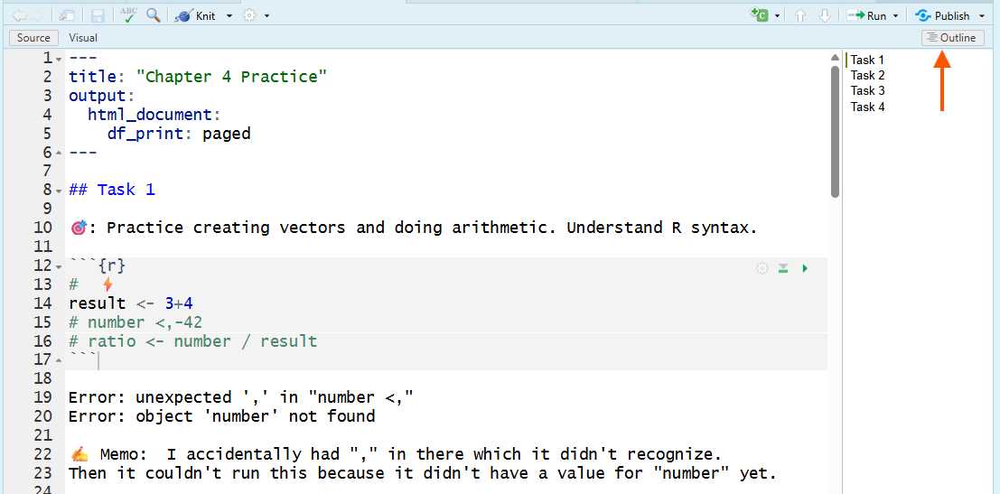
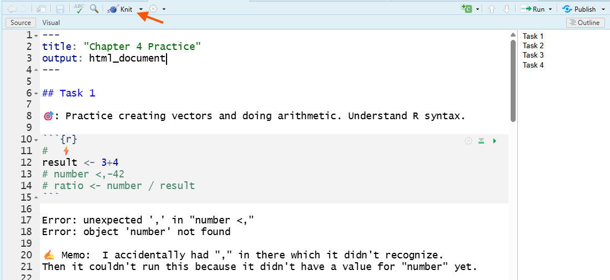
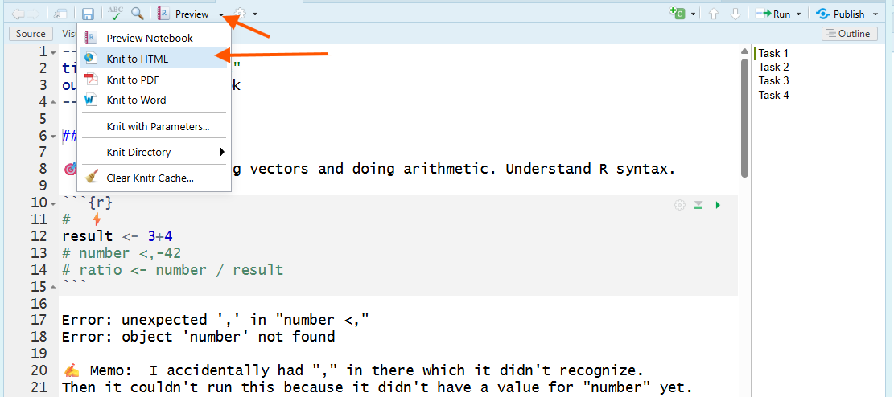
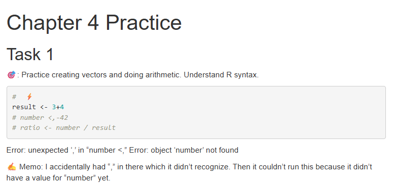

```{r setup, include=FALSE}
knitr::opts_chunk$set(echo = TRUE)
```

```{r eval=FALSE, include=FALSE}
title: "Chapter 5"
subtitle: "Help!"
author: "by Lorraine Gaudio"
date:   "`r paste('Version', format(Sys.Date(), '%B %d, %Y'))`"
output: 
  pdf_document:
    toc: true
    toc_depth: 2
    number_sections: true
    citation_package: natbib
    fig_caption: true
    df_print: kable # Data frame printing
    includes:
      in_header: ../assets/header.tex
    latex_engine: xelatex  # Use xelatex to support fontspec
fontsize: 12pt
geometry: margin=1in
mainfont: "Garamond" # Sets the font of the entire document
sansfont: "Gotham-Book.otf" # Set sans-serif font to Gotham Book
monofont: "Courier New" # Set monospace font to Courier New
documentclass: scrreprt
linkcolor: boisestateblue # Customizes the color of hyperlinks
urlcolor: magenta # Customizes the color of URLs
citecolor: black # Customizes the color of citations
bibliography: references.bib # Bibliography file
biblio-style: apalike                 # ⟵ natbib needs a .bst style
natbiboptions: "round,authoryear"     # round brackets, Author (Year)
# ---
title: "Chapter 5"
subtitle: "Help!"
author: "Lorraine Gaudio"
date:   "`r paste('Version', format(Sys.Date(), '%B %d, %Y'))`"
team: "Spring 2026"
output: 
  html_document: # To create an HTML document from R Markdown
    toc: false # Table of contents (TOC)
    toc_depth: 1 #(meaning that level 1, 2, and 3 headers will be included in the table of contents
    toc_float: # Float the table of contents to the left of the main document
      collapsed: false # Collapsed (defaults to TRUE) controls whether the TOC appears with only the top-level
      smooth_scroll: true # controls whether page scrolls are animated when TOC items are navigated to via mouse clicks.
    number_sections: true # Numbering starts with "#" (H1). Without H1 headers, the H2 headers ("##") will be numbered with 0.1, 0.2, and so on.
    css: ../assets/styles.css # This is the name of the CSS file to style the HTML document with Boise State Brand. The CSS file must be in the same directory as the R Markdown file.
    fig_caption: true #Whether figures are rendered with captions.
    df_print: paged # Printing data frames with interactivne scrolling
    includes:
      in_header: ../assets/header.html
      after_body: ../assets/footer.html
```


# Overview

In this chapter, you’ll learn how to turn your R Notebook into a shareable HTML report that another person can read **without opening RStudio**! You’ll start by using Markdown to make your notebook readable and navigable by adding a date in the YAML header and headings that create an outline so your work looks like a structured report. Then you’ll generate an HTML version of the notebook and learn how to recognize (and troubleshoot) common problems when the report fails to build. Because modern researchers often use AI tools during debugging, you’ll also learn how to write well-structured Markdown prompts to ask an LLM for targeted help without delegating your thinking. This matters now because, moving forward, you will be evaluated on whether your workflow is understandable and reproducible (CLO1), whether you can diagnose problems when something breaks (CLO2), and whether you can document responsible help-seeking and tool use as part of your process (CLO3).

In Chapter Five you will learn how to:

- #️⃣ Format your R Notebook using Markdown

- 📐 Structure prompts for Large Language Models (LLMs)

# R Notebook -> HTML Report

🎯 Please open a new R Notebook and save it in your course folder named `chapter5_notes.Rmd`. Use this document to take notes and practice the chapter content. 

1. Open RStudio → File → New File → R Notebook.

2. Save it in your course folder as: `chapter5_notes.Rmd`.

3. In your YAML header at the top, make sure the title matches this chapter.

## YAML Date Field

The YAML header is the metadata “label” for your notebook. It controls document settings like title and output format. A basic YAML header looks like this:

```yaml
---
title: "Untitled"
output: html_notebook
---
```

To add a date to your notebook, edit the YAML header to include a `date:` field. 

Method A. **Hard Code**

Manually type the date you created the notebook. Include quotation marks around the date.

```yaml
---
title: "Chapter 5 Practice"
date: "January 13, 2026"
output: html_notebook
---
```

Method B. **Dynamic Date**

Use R code to generate the current date automatically each time you knit the document. The inline R expression <code>&#96;r Sys.Date()&#96;</code> retrieves the current date from your computer’s operating system. This follows the syntax: backtick (<code>&#96;</code>), then <code>r</code>, a space, <code>Sys.Date()</code>, and a closing backtick (<code>&#96;</code>). The backtick is located above the Tab key on most keyboards.

```{r echo=FALSE, results='asis'}
cat("```yaml
---
title: \"Chapter 5 Practice\"
date: \"`r Sys.Date()`\"
output: html_notebook
---
```")
```

The **Inline R** works in YAML when written exactly as above.

## Markdown Headings

Headings are how you create a structured outline. 

### Heading levels

All HTMLs in this course were created using RStudio! You can see how the headings create a structured outline and the font sizes change with heading level.

```{markdown}
# biggest heading

Type here will be in paragraph font.

## main section heading

Type here will be in paragraph font.

### subsection heading

Type here will be in paragraph font.
```

---



---

This image is a screenshot of an RStudio R Notebook showing a Markdown section heading (## Task 1) in the editor and the Outline pane on the right listing “Task 1–Task 4,” illustrating that Markdown headings create a structured outline; the orange arrow points to the Outline button used to show/hide that heading-based outline.

In this example, the `## Task 1` heading creates a main section heading. The Outline pane on the right lists all headings in the document, allowing you to navigate quickly between sections.

### The most common beginner mistake with #

"#" means two totally different things depending on where you type it:

**Outside a code chunk**: # creates a heading (Markdown formatting).

**Inside a code chunk**: # creates a comment (R ignores it).

___

Now that you have the basics in Markdown, let’s practice creating headings in your R Notebook as you work through R coding exercises.

# Knit to HTML

When you **Knit** to HTML, RStudio creates a shareable, static report that includes your formatted headings and text, your code, and the output produced when the code runs.

This is not the same as “running a chunk”. Running a chunk uses your current R session. It can succeed even if you ran things out of order or if objects already exist in your Environment. Knitting is a full test: it runs the entire notebook top-to-bottom in a fresh session, then builds an HTML report.

📏 **Rule:** Your notebook must create every object it uses in the notebook itself (not in your Environment).

### How to Knit

RStudio UI varies. Some of you will have a **Knit button**, others will use **Preview menu** dropdown.

Option 1: **Knit button**

In the Source pane, click the **Knit button** (it looks like a ball of yarn with a knitting needle 🧶).

---



---

This image is a screenshot of RStudio showing the Knit button on the toolbar (highlighted by an orange arrow), which students can click to knit the R Notebook into an HTML document when they don’t have the Preview dropdown.

Option 2: **Preview menu**

In the Source pane, click the the **Preview menu** drop down button and select Knit to HTML. 

---



---

This image is a screenshot of RStudio with the Preview menu opened; orange arrows highlight the Preview dropdown button and the Knit to HTML option, showing how to knit an R Notebook into a shareable HTML document (not just run a single code chunk).

Below is the result you get after knitting to HTML

---



---

This image is a screenshot of the knitted HTML output in a web browser showing the notebook title (“Chapter 4 Practice”), the first section heading (“Task 1”), a memo as regular paragraph text, and an R code chunk with its printed error output, demonstrating what you get after you Knit to HTML.

When you knit, RStudio automatically does three things:

1. Starts a fresh R session (your Environment does not count).

2. Runs your notebook from top to bottom in order.

3. Produces an HTML file you can view and share.

This is why knitting is the real test of “does this notebook work?” If it knits, someone else (including future-you) can see the workflow and results without needing to open RStudio.

### Submitting the HTML File

The HTML file is automatically saved in the same folder as your R Notebook, with the same name but an `.html` extension instead of `.Rmd`. If you have not yet saved your R Notebook, RStudio will prompt you to do so before knitting.

Example:

- `chapter5_practice.Rmd`

- `chapter5_practice.html`

💡 **Tip:** the HTML opens in your browser, but the browser address is a local file path on your computer. You cannot submit a browser link.

When you open an HTML, it uses your web browser to display a nicely formatted version of your notebook, including code, output, and memos. You cannot share the HTML by sharing the web address (URL) in your browser because it is a local file on your computer. 

To submit, 📤 upload the `.html` file from your course folder (and follow any Canvas instructions your assignment page provides).

### Knit Errors

When you select to knit, the Console pane shows progress messages in the **Render tab** as R runs your notebook from top to bottom. 

A successful knit has three visible signs:

1. The Render tab shows the process finishing without an error message.

2. A browser window opens (or Viewer in File Pane) showing your notebook as a formatted web page.

3. An `.html` file appears in the same folder as your `.Rmd` file.

If knitting fails, do not guess. Do this in order:

1. Read the last error message in the **Render tab**.

2. Find the chunk that caused it (the error usually names a chunk or shows a line number).

3. Fix the first error you see. (Many later errors are just “domino effects.”)

4. Knit again.

Common reasons knitting fails:

- You wrote the code out of order, so an object exists in your Environment but is not created earlier in the notebook.

- You forgot to include setup code (creating objects, loading packages, setting a working directory, etc.).

- A chunk contains an error you didn’t notice because you never ran that chunk.

💡 **Tip:** When designing your document, knit after any meaningful formatting or code change. It’s the fastest way to catch problems early. It is easier to determine an error when it is caused by your most recent editing.

Some errors are tricky. If you get stuck, ask for help.

# Structuring LLM Prompts

One resource to troubleshooting a knit error, or many other coding problems, is using a **Large Language Model** (LLM) like ChatGPT or boisestate.ai to assist you. However, the quality of the response you get depends heavily on how you structure your prompt. The same Markdown you use in your R Notebook can also be used to structure prompts for LLMs.

## Missing Backtick

Imagine you don't know that there is a missing backtick at the end of a code chunk. You try to knit to HTML, but it fails. You ask an LLM to help you find the error.

Below are three example prompts versions: unstructured (bad), structured plain text (better), and structured Markdown (best).

### Unstructured Prompt

    What do I do? I tried knitting my R notebook and it won’t work. 

    |...... | 12% [unnamed-chunk-1]

    processing file: Chapter_4_practice.Rmd

    Error in parse():
    ! attempt to use zero-length variable name
    Quitting from Chapter_4_practice.Rmd:12-24 [unnamed-chunk-1]
    Execution halted

### Structured Plain Text Prompt

    Persona: Act as a R programming tutor.

    Task: Help me troubleshoot a knit error in an R Notebook     (`.Rmd`). I am a beginner.

    What I did: I clicked Preview > Knit to HTML in RStudio.

    What happened: Knitting stopped at 12% and failed.

    Error message (*copied from Render tab*):
    |...... | 12% [unnamed-chunk-1]
    processing file: Chapter_4_practice.Rmd
    Error in parse():
    ! attempt to use zero-length variable name
    Quitting from Chapter_4_practice.Rmd:12-24 [unnamed-chunk-1]
    Execution halted

    Context: The error says it quit from lines 12–24 in     unnamed-chunk-1. I don’t understand what “parse” means.

    What I want from you: 1. Explain what this error usually means in beginner-friendly terms. 2. Give me the most likely causes specifically for an R Notebook `.Rmd` file. 3. Give me a checklist of what to look for around lines 12–24 to fix it.

### Structured Prompt:

    # Persona: 

    Act as a R programming tutor.

    # Task: 

    Help me troubleshoot a knit error in an R Notebook (`.Rmd`). 

    # What I did: 

    In RStudio, I clicked Preview → Knit to HTML.

    # What happened: 

    Knitting stopped at 12% and failed.

    # Error message (copied exactly):

```markdown
|......                                              |  12% [unnamed-chunk-1]

processing file: Chapter_4_practice.Rmd

Error in `parse()`:
! attempt to use zero-length variable name
Backtrace:
...
Quitting from Chapter_4_practice.Rmd:12-24 [unnamed-chunk-1]
Execution halted
```

    # Context: 

    The error says it quit from lines 12–24 in unnamed-chunk-1. I don’t understand what “parse” means.

    # What I want from you:

    1. Explain what “Error in parse()” means in plain language.

    2. Tell me the top 3 most common causes in an `.Rmd` file.

    3. Give me a step-by-step fix plan focused on the section lines 12–24.

___

*If you use LLMs to help with R code, always document when and how you used the tool in your R Notebook. Unless explicitly stated in assignment instructions, do not ask LLMs to write code for you. Quote all copy-paste LLM-generated code and write a memo about what you learned. This maintains academic integrity and helps you understand and maintain your autonomy as a learner.*

# Summary

In Chapter 5, you learned how to use an R Notebook as more than a place to run code—you learned how to produce a clear, shareable HTML report that documents your work in a way that another person (or future-you) can follow. You practiced Markdown basics that make your notebook readable, including adding a date in the YAML header and using headings to create an outline. Finally, you learned what it means to generate an HTML report from your notebook (running everything top-to-bottom in a fresh session) and how to troubleshoot errors when that process fails—especially formatting mistakes like broken code chunk fences—and you practiced writing structured, Markdown-based prompts to get useful help from an LLM while still documenting your own reasoning and changes.

# Chapter Terms

**Backtick**: The &#96; character (above the Tab key) used for code-related formatting and quoting. In **Markdown**, single backticks mark *inline code* and triple backticks create *fenced code blocks*; in **R Markdown**, backticks also mark *inline R code* (<code>&#96;r ...&#96;</code>), including inside YAML fields like <code>date: "&#96;r Sys.Date()&#96;"</code>, which gets evaluated when you render the document. In R, backticks can also quote non-syntactic names (e.g., names with spaces) so they can be used safely in code.

**HTML**: A web page file type (`.html`) written in **HyperText Markup Language** that a web browser can open and display as a formatted document. In this course, Preview/Knit/Render can create an HTML file (often `.html` or `.nb.html`) that shows your notebook’s text, code, and output in the browser; because it opens from your computer (a local `file://` path), you can’t submit it by copying the browser address. Upload the HTML file itself.

**Inline R**: A short R expression written inside backticks with the prefix `r` (for example, <code>&#96;r Sys.Date()&#96;</code>) that is evaluated when you knit/render the document and replaced with its result in the output. Inline R is used to insert dynamic values (dates, computed statistics, labels) directly into your narrative text, and it can also be used in YAML fields like <code>date: "&#96;r Sys.Date()&#96;"</code> when supported.

**Knit**: In RStudio, the action that renders an `.Rmd` (including an R Notebook) into a finished output file (such as HTML, PDF, or Word) by running the document’s code chunks, inserting their results, and converting the document to the chosen format. Clicking the Knit button typically calls `rmarkdown::render()` in a new, clean R session, so everything needed to reproduce the result must be created or loaded in the document itself, and the output file is saved alongside the `.Rmd`.

**Knit Button**: The toolbar button in RStudio that renders an R Markdown file (`.Rmd`) into a finished output (e.g., HTML, PDF, Word) by calling `rmarkdown::render()` and running the document’s code to generate results. The output file is saved next to the `.Rmd` (same base name), and the button’s drop-down lets you choose among available output formats (shortcut: Ctrl/Cmd + Shift + K).

**Large Language Models (LLMs)**: AI systems trained on massive collections of text and code to predict and generate language, including R code and explanations. In an R-learning context, LLMs can help you brainstorm, interpret error messages, and draft code—but they can also produce plausible-sounding mistakes, so you must verify outputs, understand each line you run, and document when and how you used the tool.

**Markdown**: A lightweight plain-text formatting syntax used to write structured documents (headings, lists, links, emphasis, code) in a way that stays readable as plain text and can be rendered into formats like HTML on many platforms and tools.

**Preview Menu**: The drop-down attached to the Preview button in an R Notebook (`output: html_notebook`) that lets you generate a quick notebook preview and choose other render (“knit”) actions (e.g., HTML/PDF/Word). Preview renders an HTML view using outputs from chunks you’ve already run (it does not re-execute code), while knit options render the full document to the selected output format.

**Render Tab**: A temporary tab that appears in RStudio’s Console pane when you Knit/Render an R Markdown (`.Rmd`) or Quarto (`.qmd`) document. It shows the rendering log—progress messages, warnings, and errors—separately from your interactive Console, and typically includes a Stop control so you can interrupt a failed or long render.

**YAML Header**: The metadata section at the top of an R Markdown or Quarto document, written between `---` lines, that controls document settings like the title, author, date, output format (HTML/PDF/Word), and options for rendering.


# 📝 Practice Space

**Hack-A_Prompt**

In this Practice Space, you will write a **Markdown prompt** that instructs a Large Language Model (LLM) to generate a specific R code chunk exactly as shown. The goal is to practice two core research skills:

- **Clear specification**: describing code requirements precisely (like you would in a methods section)

- **Reproducibility**: checking that code runs from a clean start

**Before you begin**

1. Created a R Notebook in the Source pane and saved it as `chapter5_practice.Rmd` in your course folder. 
2. Start clean: Click the 🧹 **broom icon** in the Environment pane to clear objects.

3. Write short memos documenting problems, fixes, and any help you used (**tenacity** + **transparency**).

## Task 1

**Organize your notebook with headings**

🎯 Use Markdown headings to organize your notebook so a reader can follow your work.

Your notebook must include at least:

- One top-level title heading (Level 1)

- Four section headings (Level 2 or Level 3)

Your headings must clearly separate:

1. Your prompt draft

2. The LLM output you received

3. Your memo comparing output vs target

4. Your revision attempt and result

💡 **Tip:** Headings should describe what’s in the section (not “Section 1”).

## Task 2

**Write a prompt that reproduces the target code**

🎯 Write a Markdown-structured prompt that *you think* will makes an LLM generate a specific R code chunk exactly.

1. Read the target code chunk below. Don't run it yet.

2. In your R Notebook, compose a Markdown-structured prompt that you think will cause an LLM to output this exact code chunk (same object names, same order, same functions).

Rules: 

- You cannot copy-paste any part of the target code chunk into your prompt. 

- You should use the exact names of objects and functions as needed.

- Your prompt must be structured using Markdown headings.

```{r, eval=FALSE}
# Target Code Chunk
sales_q1 <- c(120, 135, 150, 160)
sales_q2 <- c(125, 130, 155, 170)

growth <- sales_q2 - sales_q1

positive_growth <- growth[growth > 0]
last_two <- sales_q2[c(3, 4)]

length(sales_q1)
length(sales_q2)
class(growth)
```

## Task 3

**Test your prompt and document what happened**

🎯 Test your prompt in an LLM *(recommend boisestate.ai).*

1. Paste your prompt into the LLM chat box and submit it.

2. Place the LLM’s output an a code chunk in your notebook and run it.

3. Write a memo (4–8 sentences) that includes:

- What matched the target exactly

- What did not match

- What you changed (or will change) in the prompt to fix it

- State the name of the LLM that you used.

## Task 4

**Revise your prompt and retest**

Could you improve your prompt?

🎯 Revise your prompt until you get the **exact** target code chunk.

💡 **Tip:** Review and use Chapter 4's **Chapter Terms**.

- Include at least one revised prompt attempt

- Include the revised LLM output

- Include a short memo explaining what you changed and why

## Task 5

🎯 **Step 1: Sweep your Environment (start clean).**  
Click the 🧹 **broom icon** in the Environment pane to clear objects.

🎯 **Step 2: Run everything top-to-bottom.**  
Use **Run → Run All** to execute every chunk in order.

🎯 **Step 3: Save and submit.**  
After your notebook runs without errors, save your notebook (`.Rmd`) and knit to HTML (`.HTML`) for submission to Canvas, as directed. 

If you have any issues knitting, document the error message, your troubleshooting steps, and any help you used in your notebook.