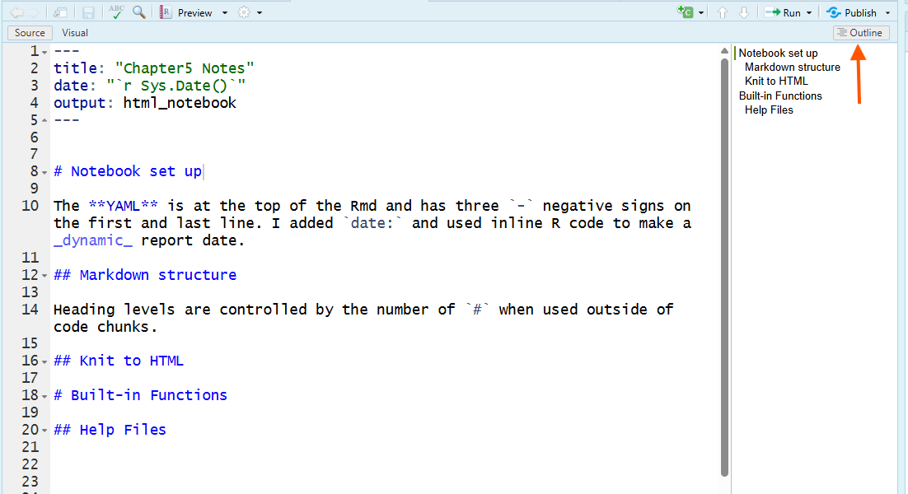
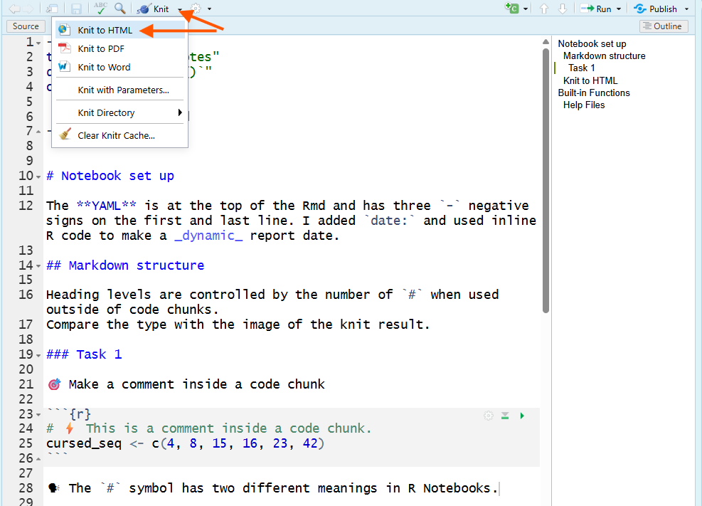
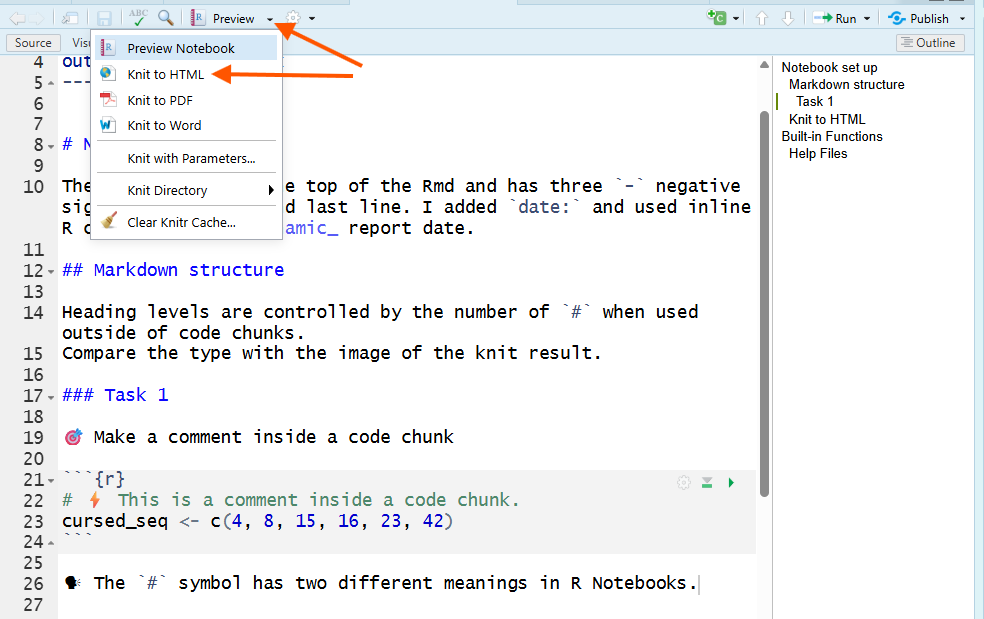

```{r setup, include=FALSE}
knitr::opts_chunk$set(echo = TRUE)
```

```{r eval=FALSE, include=FALSE}
title: "Chapter 5"
subtitle: "Help!"
author: "by Lorraine Gaudio"
date:   "`r paste('Version', format(Sys.Date(), '%B %d, %Y'))`"
output: 
  pdf_document:
    toc: true
    toc_depth: 2
    number_sections: true
    citation_package: natbib
    fig_caption: true
    df_print: kable # Data frame printing
    includes:
      in_header: ../assets/header.tex
    latex_engine: xelatex  # Use xelatex to support fontspec
fontsize: 12pt
geometry: margin=1in
mainfont: "Garamond" # Sets the font of the entire document
sansfont: "Gotham-Book.otf" # Set sans-serif font to Gotham Book
monofont: "Courier New" # Set monospace font to Courier New
documentclass: scrreprt
linkcolor: boisestateblue # Customizes the color of hyperlinks
urlcolor: magenta # Customizes the color of URLs
citecolor: black # Customizes the color of citations
bibliography: references.bib # Bibliography file
biblio-style: apalike                 # ⟵ natbib needs a .bst style
natbiboptions: "round,authoryear"     # round brackets, Author (Year)
# ---
title: "Chapter 5"
subtitle: "Help!"
author: "Lorraine Gaudio"
date:   "`r paste('Version', format(Sys.Date(), '%B %d, %Y'))`"
team: "Spring 2026"
output: 
  html_document: # To create an HTML document from R Markdown
    toc: false # Table of contents (TOC)
    toc_depth: 1 #(meaning that level 1, 2, and 3 headers will be included in the table of contents
    toc_float: # Float the table of contents to the left of the main document
      collapsed: false # Collapsed (defaults to TRUE) controls whether the TOC appears with only the top-level
      smooth_scroll: true # controls whether page scrolls are animated when TOC items are navigated to via mouse clicks.
    number_sections: true # Numbering starts with "#" (H1). Without H1 headers, the H2 headers ("##") will be numbered with 0.1, 0.2, and so on.
    css: ../assets/styles.css # This is the name of the CSS file to style the HTML document with Boise State Brand. The CSS file must be in the same directory as the R Markdown file.
    fig_caption: true #Whether figures are rendered with captions.
    df_print: paged # Printing data frames with interactivne scrolling
    includes:
      in_header: ../assets/header.html
      after_body: ../assets/footer.html
```


# Overview

Chapter 5 focuses on making your R Notebook organized, reproducible, and shareable.

You will learn how to use Markdown and YAML to structure your notebook, then knit it into an HTML report that someone else can read without opening RStudio. You will also practice using R help files to understand functions, arguments, and examples instead of trying to memorize everything.

The main goal of this chapter is to build confidence with the normal problem-solving process in R: write code, test it, read messages carefully, use help resources, revise your work, and document what you learned.

In Chapter Five, you will practice how to:

- #️⃣ Format your R Notebook using Markdown headings.

- 🧾 Add basic document information in the YAML header.

- 📤 Knit an R Notebook into a shareable HTML report.

- ⚠️ Recognize common reasons a notebook fails to knit.

- 🛠 Use error messages and help files to troubleshoot problems.

- 🔎 Open and read R help pages for functions.

- 🧮 Identify required arguments and default arguments.

- ✅ Use help pages to solve a problem with missing values.

- ✍️ Document the help you used and explain how it improved your code.

---

# R Notebook -> HTML Report


In this section, you will learn how to turn your R Notebook into a shareable HTML report. Data analysis reports are not just for sharing results. They are also for sharing the process of getting to those results. In this course, your R reports are more than a place to type code. They are where you practice being brave enough to try, notice when something is wrong, and keep going instead of hiding the mess. Courage here means documenting where you got stuck, asking for help when needed, and showing the learning process that helped you move forward. 

🎯 Please open a new R Notebook and save it in your course folder named `chapter5_notes.Rmd`. Use this document to take notes and practice the chapter content. 

1. Open RStudio → File → New File → R Notebook.

2. Save it in your course folder as: `chapter5_notes.Rmd`.

3. Remove the default content.

> When a new R Notebook opens, RStudio automatically includes sample text and example code. Delete all of that default template content before you begin your own report. Your final HTML report should contain only your own headings, notes, code, output, and explanations for this chapter.

4. In your **YAML header** at the top, make sure the title matches this chapter.

## YAML Date Field

The **YAML header** is the metadata “label” for your notebook. It controls document settings like the title, date, and output format.

Good document labels help future-you, your peers, collaborators, and *your instructor* understand what the file is, when it was created, and what kind of output RStudio should build. This is a small documentation habit, but it matters when you are trying to keep your work organized.

A basic YAML header looks like this:

```yaml
---
title: "Untitled"
output: html_notebook
---
```

To add a date to your notebook, edit the YAML header to include a `date:` field. 

Method A. **Hard Code**

Manually type the date you created the notebook. Include quotation marks around the date.

```yaml
---
title: "Chapter 5 Practice"
date: "January 13, 2026"
output: html_notebook
---
```

Method B. **Dynamic Date**

Use R code to generate the current date automatically each time you knit the document. The inline R expression <code>&#96;r Sys.Date()&#96;</code> retrieves the current date from your computer’s operating system. This follows the syntax: backtick (<code>&#96;</code>), then <code>r</code>, a space, <code>Sys.Date()</code>, and a closing backtick (<code>&#96;</code>). The backtick is located above the Tab key on most keyboards.

```{r echo=FALSE, results='asis'}
cat("```yaml
---
title: \"Chapter 5 Practice\"
date: \"`r Sys.Date()`\"
output: html_notebook
---
```")
```

The **Inline R** works in YAML when written exactly as above. You can learn more about inline R in the 📝 Notebook Advanced Activity, but for now, you can copy and paste the above YAML section to add a dynamic date to your YAML header. Each time you knit the document, the date will update to the current date.

---

Now that your notebook has a clear label, you need a clear structure inside the document. That is where Markdown headings come in.

#### Heading levels

Headings create the outline of your notebook. The number of `#` symbols controls the heading level.

```markdown
# Biggest heading

Type here will be in paragraph font.

## Main section heading

Type here will be in paragraph font.

### Subsection heading

Type here will be in paragraph font.
```

All Chapter HTMLs in this course were created using RStudio. You can see how headings create a structured outline and how the font sizes change with heading level.

The "outline pane" in RStudio uses your Markdown headings to create a clickable map of your document. This *document outline* or **outline menu** in the Source pane shows your headings/subheadings. They act as "Jump To" menus, helping you move between tasks without scrolling through the whole notebook.

---



---

This image is a screenshot of an RStudio R Notebook showing a Markdown section heading (## Task 1) in the editor and the Outline menu on the right listing “Task 1–Task 4,” illustrating that Markdown headings create a structured outline; the orange arrow points to the Outline button used to show/hide that heading-based outline.

### The most common beginner mistake with `#`

In the above example, the `## Task 1` heading creates a main section heading. The outline menu on the right lists all headings in the document, allowing you to navigate quickly between sections. Put spacing between the `#` symbols and the heading text to ensure heading formatting works correctly. For example, `##Task 1` will not format as a heading, but `## Task 1` will.


The `#` symbol means two different things depending on where you type it.

**Outside a code chunk**, `#` creates a Markdown heading.

```markdown
## Task 1
```

**Inside a code chunk**, `#` creates an R comment. R ignores the comment when it runs the code.

```r
# This is a comment inside a code chunk.
cursed_seq <- c(4, 8, 15, 16, 23, 42)
```

✅ Check: If you want to make a heading in your notebook, type `#` outside the code chunk. If you want a note about your code, type `#` inside the code chunk as a comment OR outside the code chunk without `#`.

---

Now that you have the basics of Markdown structure, you will test whether the whole notebook can become a working HTML report.

# Knit to HTML

When you **Knit** to HTML, RStudio creates a shareable, static report that includes your formatted headings and text, your code, and the output produced when the code runs. The HTML is not a website and you cannot share it by sharing a URL. It is a file on your computer that you can open in a web browser and share with others by sharing the file itself.

Knitting is not the same as “running a chunk.” Running a chunk uses your current R session. This means that running a code chunk can succeed even if you wrote code out of order or if objects used already exist in your Environment.

Knitting is a stronger test. It runs the entire notebook from top to bottom in a *fresh* session, then builds an HTML report.

📏 **Rule:** Your notebook must create every object it uses in the notebook itself. Your Environment does not count. Knitting may reveal a code error you did not notice. That is not a failure. It is useful information about the *first place* your workflow that needs attention.

### How to Knit

RStudio UI varies. Some of you will have a **Knit button**, others will use **Preview menu** dropdown.

Option 1: **Knit button**

In the Source pane, click the **Knit button** (it looks like a ball of yarn with a knitting needle 🧶).

---



---

This image is a screenshot of RStudio showing the Knit button on the toolbar (highlighted by an orange arrow), which students can click to knit the R Notebook into an HTML document when they don’t have the Preview dropdown.

Option 2: **Preview menu**

In the Source pane, click the the **Preview menu** drop down button and select Knit to HTML. 

---



---

This image is a screenshot of RStudio with the Preview menu opened; orange arrows highlight the Preview dropdown button and the Knit to HTML option, showing how to knit an R Notebook into a shareable HTML document (not just run a single code chunk).

Below is the result you get after knitting to HTML

---


---

This image is a screenshot of the knitted HTML output in a web browser showing the notebook title (“Chapter 4 Practice”), the first section heading (“Task 1”), a memo as regular paragraph text, and an R code chunk with its printed error output, demonstrating what you get after you Knit to HTML.

When you knit, RStudio automatically does three things:

1. Starts a fresh R session (your Environment does not count).

2. Runs your notebook from top to bottom in order.

3. Produces an HTML file you can view and share.

This is why knitting is the real test of “does this notebook work?” If it knits, someone else (including future-you) can see the workflow and results without needing to open RStudio.

### Submitting the HTML File

The HTML file is automatically saved in the same folder as your R Notebook, with the same name but an `.html` extension instead of `.Rmd`. If you have not yet saved your R Notebook, RStudio will prompt you to do so before knitting.

Example:

- `chapter5_practice.Rmd`

- `chapter5_practice.html`

💡 **Tip:** the HTML opens in your browser, but the browser address is a local file path on your computer. You cannot submit a browser link.

When you open an HTML, it uses your web browser to display a nicely formatted version of your notebook, including code, output, and memos. You cannot share the HTML by sharing the web address (URL) in your browser because it is a local file on your computer. 

To submit, 📤 upload the `.html` file from your course folder (and follow any Canvas instructions your assignment page provides).

### Knit Errors

When you select to knit, the Console pane shows progress messages in the **Render tab** as R runs your notebook from top to bottom. 

A successful knit has three visible signs:

1. The Render tab shows the process finishing without an error message.

2. A browser window opens (or Viewer in File Pane) showing your notebook as a formatted web page.

3. An `.html` file appears in the same folder as your `.Rmd` file.

If knitting fails, do not guess. Work through the first error in order.

1. Read the last error message in the **Render tab**.
2. Find the chunk that caused it. The error usually names a chunk or shows a line number.
3. Fix the first error you see. Many later errors are just “domino effects.”
4. Knit again.

❓Question: What is the first specific problem R is naming?

🧠 Growth mindset: A knit error is a **Not yet** signal. It does not prove that you cannot code. It shows where your notebook needs revision.

Common reasons knitting fails:

- You wrote the code out of order, so an object exists in your Environment but is not created earlier in the notebook.
- You forgot to include setup code, such as creating objects, loading packages, or setting a working directory.
- A chunk contains an error you did not notice because you never ran that chunk.

💡 **Tip:** Knit after any meaningful formatting or code change. It is easier to find an error when it was caused by your most recent edit.

Some errors are tricky. If you get stuck, bring the error message, the chunk, and what you already tried to a peer, office hours, or another approved course resource.

---

Next, you will shift from building the report to writing code inside it. The same pattern still applies: try the code, check what happens, and use resources when you need them.

# Built-in Functions

Now that your notebook can become an HTML report, you need code worth documenting inside it.

Many built-in summary functions take a whole vector as input and return one summary value, or a small set of values. These are summary functions because they reduce many values down to a smaller result.

In this section, you will practice calling a function and noticing the difference between the stored function object and the function call that actually runs.

## Function Objects vs. Function Calls

A **function object** is the stored code that performs a task. For example, `mean` is a function object that calculates the average of a numeric vector. The stored code sums the values and divides by the number of values.

```{r}
# ⚡ Type this in your R Notebook inside a code chunk
mean
```

🗣 Don’t worry if what prints looks cryptic. You are not expected to understand every line of stored function code right now. The important point is that `mean` by itself refers to the stored function object.

To make the function do its job, you have to call it. A **function call** runs the stored code. To call a function, you type the function name followed by parentheses `()`. Inside the parentheses, you must provide any **required arguments**. For example, to calculate the mean of a numeric vector, you call the `mean()` function and provide the vector as an argument. The vector is a **required argument** because the function needs it to perform the calculation. 

📜 The SYNTAX (basic): 

`mean(x)`

where `x` is the numeric vector you want to summarize.

🎯 Calculate the mean of the cursed sequence. 

```{r}
# ⚡ Type this in your R Notebook
cursed_seq <- c(4, 8, 15, 16, 23, 42)  

mean(cursed_seq)                     
```

🗣 The `mean()` function calculates the average of the numbers in the `cursed_seq` vector by summing them up and dividing by the count of numbers.

# Help Files

Looking for help is not always a shortcut around learning. It can be one way you stay engaged when you do not already know what to do. Nobody memorizes every function or every argument. Skilled R users look things up.

`?function_name` opens the help file. The **Files pane** usually contains several tabs, including the **Help tab**, which displays documentation for R functions.

## No Required Arguments

Some functions do not have a required argument. For example, the `Sys.Date()` function returns the current date without needing any input.

🎯 Call the `Sys.Date()` function to get the current date from your computer's operating system. 

```{r}
# ⚡ Type this in your R Notebook
Sys.Date()
```

🗣 The `Sys.Date()` function retrieves the current date from the system clock and returns it as a Date object.

🎯 Open the help file for the `Sys.Date()` function.

```{r, eval=FALSE}
# ⚡ Type this in your R Notebook
?Sys.Date
```

🗣 The `Sys.Date` help page opens in the **help tab** in the **files pane**. Note that `Sys.Date()` has no required arguments.

Scroll through the help file to find information about the function's usage, arguments, and examples.

- **Usage**: shows the function signature and defaults.

- **Arguments**: what each argument does.

- **Examples**: copy/run examples to learn patterns.

---

`Sys.Date()` is a friendly first example because it does not require an input. Most functions you use for data analysis will need at least one argument. Next, you will compare this to `mean()`, which needs a vector to summarize.

## Required Arguments

🎯 Open the help file for the `mean()` function. Scroll through the help file to find information about the function's usage, arguments, and examples.

- **Usage**: shows the function signature and defaults.

- **Arguments**: what each argument does.

- **Examples**: copy/run examples to learn patterns.

```{r, eval=FALSE}
# ⚡ Type this in your R Notebook
?mean   
help(mean)
```

🗣 The mean **help page** opens in the **help tab** in the **files pane**. `mean.default(x, trim = 0, na.rm = FALSE, …)` shows that `x` is a required argument, while `trim` and `na.rm` have default values.

## Default Arguments

**Default arguments** are inputs that a function uses in situations when you did not provide that argument. For example, the `trim` argument in the `mean()` function allows you to exclude a certain percentage of the lowest and highest values before calculating the mean.

The SYNTAX (with one default argument):
 
 `mean(x, trim = 0)`

🎯 Calculate the trimmed mean of the cursed sequence, removing 20% of the lowest and highest values before computing the mean.
 
```{r}
# ⚡ Type this in your R Notebook
mean(cursed_seq, trim = 0.2)  # drop 20% from each end first
```

🗣 The `mean()` function first removes 20% of the lowest and highest values from the `cursed_seq` vector, then calculates the mean of the remaining values. With 6 values and `trim = 0.2`, R trims 4 and 42, then averages 8, 15, 16, and 23.

*How can you tell which arguments are required?*

The main clue that `x` is required is that it has no `=` sign or default value next to it in the usage section. The other arguments have `=` signs, showing the default values that R will use if you don't provide your own.

Some functions use `...` (dot-dot-dot). That means “additional optional arguments may be allowed,” not required ones. For now, ignore `...` until you are more advanced.

📜 Argument clue:

- no `=` → usually required
- `=` → R has a default value
- `...` → extra optional arguments may be allowed; ignore this for now

This clue helps you read help pages faster. You do not need to understand the whole page before you can use one useful part of it.

# Reading R Help Pages

Help pages are useful, but they are not written like beginner tutorials. They are written like reference pages. That means your job is not to read every word. Your job is to know **where to look first** when you are trying to write, fix, or explain code. This section gives you a reading strategy for help pages.

## Open a Help Page When You Know the Function Name

If you know the function name, type a question mark before the function name.

```{r, eval=FALSE}
# ⚡ Type this in your R Notebook
?mean
```

You can also use the `help()` function.

```{r, eval=FALSE}
# ⚡ Type this in your R Notebook
help(mean)
```

🗣 The help page usually opens in the **Help tab** in the bottom-right area of RStudio. That area contains several tabs, such as **Files**, **Plots**, **Packages**, **Help**, and **Viewer**. If you do not see the help page right away, look for the **Help** tab.

## Do Not Read the Whole Help Page First

Help pages can look overwhelming. That is normal.

When you open a help page, use this reading order:

1. **Description**: What does this function do?
2. **Usage**: What does the function call look like?
3. **Arguments**: What goes inside the parentheses?
4. **Examples**: What is one working pattern I can test?

For now, you may skim or skip sections like **Details**, **Value**, **References**, and **See Also** unless the instructions ask you to use them.

🗣 The goal is not to understand the entire help page. The goal is to find the information that helps you write, fix, or explain your code.

---

Next, you will apply that reading order to one specific usage line from the `mean()` help page.

# Help Page Decoder

Now you will decode one help-page line piece by piece. The goal is not to memorize the documentation. The goal is to learn how to extract the part that helps you write the function call.

## The Usage Section

The **Usage** section shows the basic recipe for writing the function call.

Open the help page for `mean()`.

```{r, eval=FALSE}
# ⚡ Type this in your R Notebook
?mean
```

In the **Usage** section, you may see something like this:

```{r, eval=FALSE}
mean.default(x, trim = 0, na.rm = FALSE, ...)
```

Do not worry about `mean.default()` right now. You can still type `mean()` in your own code.

Read the usage line like this:

| Part | What it means |
|---|---|
| `mean.default()` | This is the version of `mean()` R is documenting. You can still type `mean()`. |
| `x` | Required. This is the object you want R to average. |
| `trim = 0` | Optional. R uses `0` unless you choose a different value. |
| `na.rm = FALSE` | Optional. R keeps missing values unless you choose `TRUE`. |
| `...` | Extra options may be allowed. Ignore this for now. |

## Required Arguments vs. Default Arguments

A **required argument** is an input the function needs before it can do its job.

A **default argument** is an input R already has a value for. You can use the default value, or you can replace it with your own value.

📜 The basic rule:

- No `=` sign usually means the argument is required.
- An `=` sign means R has a default value.
- A default argument is optional, but it may still be important for your task.

🗣 In `mean.default(x, trim = 0, na.rm = FALSE, ...)`, the argument `x` is required because it does not have a default value. The arguments `trim` and `na.rm` are optional because R already has default values for them.

## Use the Help Page to Solve a Problem

Now you will use the help page for a real troubleshooting task.

You will create a vector with a missing value, try a calculation, notice the result, and then use the help page to decide which argument needs to change.

🎯 Create a vector with one missing value. 💬 Prediction: What do you think R will return when one value is missing?

```{r}
# ⚡ Type this in your R Notebook
messy_scores <- c(80, 90, NA, 100)

print(messy_scores)
```

🗣 The value `NA` means the data value is missing. It is not character or numeric value. It means the third entry is empty. 

🎯 Try to calculate the mean.

```{r}
# ⚡ Type this in your R Notebook
mean(messy_scores)
class(messy_scores)
```

🗣 R returns `NA` because the vector contains a missing value. By default, `mean()` does not remove missing values before calculating the average.

This is the moment to use the help page. Do not guess which argument to use. Look it up.

🎯 Open the help page for `mean()`.

```{r, eval=FALSE}
# ⚡ Type this in your R Notebook
?mean
```

✅ Check: In the **Arguments** section, find the argument named `na.rm`.

Ask yourself:

- What does `na.rm` control?
- What default value does R use?
- What value should I use if I want R to remove missing values?

🎯 Try the code again using `na.rm = TRUE`.

```{r}
# ⚡ Type this in your R Notebook
mean(messy_scores, na.rm = TRUE)
```

🗣 The argument `na.rm = TRUE` tells R to remove missing values before calculating the mean. This does not delete the missing value from your original vector. It only tells `mean()` how to handle the missing value during this calculation.

✅ Check your understanding:

```{r}
# ✅ Check:
print(messy_scores)
```

🗣 The original vector still contains `NA`. The argument `na.rm = TRUE` changed the calculation, not the stored data.

You solved the problem by changing the function call, not by deleting the missing value from the vector.

---

Next, you will see how help-page examples can give you working patterns even when they are not your exact assignment answer.

## Help Pages Working Patterns

The **Examples** section is often one of the most useful parts of a help page.

Examples are not usually your exact answer. They are working patterns.

Your job is to:

1. Find an example that runs.
2. Notice the pattern.
3. Adapt the pattern to your own object.

That is different from copying blindly. You are using the example to understand a structure, then applying that structure to your own task.

🎯 Run R's built-in examples for `mean()`.

```{r, eval=FALSE}
# ⚡ Type this in your R Notebook
example(mean)
```

🗣 The `example()` function runs examples from the help page. You do not need to understand every line. Look for one pattern that helps you understand how the function is used.

✅ Check: After running `example(mean)`, answer this question in a sentence:

🗣 What is one pattern you noticed in how `mean()` is used?

---

## When You Do Not Know the Function Name

So far, you knew the function name: `mean()`.

Sometimes you know the topic, but you do not know the function name.

For example, you might know you need help with missing values, but you may not know which function or argument to search for.

In that case, use `??` or `help.search()`.

```{r, eval=FALSE}
# ⚡ Type this in your R Notebook
??"missing values"
```

```{r, eval=FALSE}
# ⚡ Type this in your R Notebook
help.search("missing values")
```

🗣 Use `?function_name` when you already know the function name. Use `??"search words"` or `help.search("search words")` when you know the topic but not the exact function.

| Situation | What to type |
|---|---|
| I know the function name. | `?mean` |
| I know the function name and want another option. | `help(mean)` |
| I know the topic but not the function name. | `??"missing values"` |
| I want to search help pages for a phrase. | `help.search("missing values")` |
| I want to run built-in examples. | `example(mean)` |

---

# Memo Practice: Document the Help You Used

In this course, troubleshooting is part of the work. When you use a resource, document what you used and how it helped.

🎯 Add a short help note to your memo to your report.

Type the resource note, check, and comment as regular Markdown text. Put only the runnable R code inside the code chunk.

```

I used `?mean` to read about the `na.rm` argument.

The help page showed that `na.rm` defaults to `FALSE`.

I changed `na.rm` to `TRUE` because my vector contained an `NA` value.
```
```{r}
# ⚡ Code
messy_scores <- c(80, 90, NA, 100)
# ✅ Check
mean(messy_scores, na.rm = TRUE)
```

```
🗣 The result is `90` because R averaged `80`, `90`, and `100` after removing `NA` from the calculation.


🗣I learned that a default argument can be optional but still important. In this case, `na.rm` had a default value, but I needed to change it for my data.

```

This is transparent coding. A future reader can see what problem you had, what resource you used, what you changed, and why the change made sense.

---


# Summary

In this chapter, you strengthened your R Notebook habits by learning how to create a complete, shareable HTML report. You practiced editing the YAML header, using Markdown headings to organize your notebook, knitting your work to HTML, and submitting the actual `.html` file rather than a browser link.

You also learned that knitting is the real test of whether your notebook works. Running a single chunk only checks part of the code in your current R session, but knitting runs the whole notebook from top to bottom in a fresh session. When knitting fails, the error message is feedback that helps you find what needs to be fixed next.

Finally, you learned how to use built-in R functions and help files. You practiced the difference between a function object and a function call, identified required and default arguments, used `?function_name`, `help()`, `example()`, and `help.search()` to find information, and changed `na.rm = TRUE` to handle missing values in a calculation.

Your main takeaway is that strong R work depends on organized notebooks, successful knitting, and the courage to use errors and help files as part of the coding process.

---

# Chapter Terms

**Arguments**: Inputs that you provide to functions to customize their behavior. Arguments are specified within the parentheses of a function call and can modify how the function operates or what data it processes.

**Default Arguments**: Inputs that already have a preset value in the function definition and are used automatically when you don’t provide your own (e.g., `mean(..., na.rm = FALSE)` by default).

**Function Call**: The act of running a function by writing its name followed by parentheses, optionally supplying arguments inside (e.g., `mean(x)`). 

**Function Object**: A function stored as an R object (functions are “first-class” in R, meaning you can assign them to names, pass them to other functions, and inspect them). 

**Help Page**: Documentation for R functions and packages that provides information on usage, arguments, and examples. Accessed using `?function_name` or `help(function_name)`.

**Help Tab**: Located in the Files/Plots/Packages/Help pane, this tab provides access to R documentation, package vignettes, and search functionality to find help topics related to R functions and packages.

**HTML**: A web page file type (`.html`) written in **HyperText Markup Language** that a web browser can open and display as a formatted document. In this course, Preview/Knit/Render can create an HTML file (often `.html` or `.nb.html`) that shows your notebook’s text, code, and output in the browser; because it opens from your computer (a local `file://` path), you can’t submit it by copying the browser address. Upload the HTML file itself.

**Inline Code**: Code-style text placed within a sentence by surrounding the text with single backticks, such as `penguins`. In Quarto and Markdown, inline code is used to mark object names, function names, file names, or short code expressions so they appear in a monospace code font in the rendered report. This formatting signals to the reader, “treat this as code or a code-related name,” not as ordinary prose. 

**Inline R**: A short R expression written inside backticks with the prefix `r` (for example, <code>&#96;r Sys.Date()&#96;</code>) that is evaluated when you knit/render the document and replaced with its result in the output. Inline R is used to insert dynamic values (dates, computed statistics, labels) directly into your narrative text, and it can also be used in YAML fields like <code>date: "&#96;r Sys.Date()&#96;"</code> when supported.

**Knit**: In RStudio, the action that renders an `.Rmd` (including an R Notebook) into a finished output file (such as HTML, PDF, or Word) by running the document’s code chunks, inserting their results, and converting the document to the chosen format. Clicking the Knit button typically calls `rmarkdown::render()` in a new, clean R session, so everything needed to reproduce the result must be created or loaded in the document itself, and the output file is saved alongside the `.Rmd`.

**Knit Button**: The toolbar button in RStudio that renders an R Markdown file (`.Rmd`) into a finished output (e.g., HTML, PDF, Word) by calling `rmarkdown::render()` and running the document’s code to generate results. The output file is saved next to the `.Rmd` (same base name), and the button’s drop-down lets you choose among available output formats (shortcut: Ctrl/Cmd + Shift + K).

**Outline Menu**: A navigation tool in RStudio that uses your Markdown headings to create a clickable map of an `.Rmd` or `.qmd` document. The outline shows the structure of the notebook by heading level, so you can jump between sections without scrolling through the whole file. In RStudio, open it from the Outline button/menu in the Source pane toolbar.

**Required Arguments**: Inputs a function needs because they have no default value in the function definition; you must supply them in the call (or the function can’t do its job). 

**YAML Header**: The metadata section at the top of an R Markdown or Quarto document, written between `---` lines, that controls document settings like the title, author, date, output format (HTML/PDF/Word), and options for rendering.

---

# 📝 Practice Space

Fill in the blanks and answer the short prompts in your R Notebook. This Practice Space helps you check whether you can organize a notebook, read an R help page, use a function argument, and knit your work into an HTML report.

Before you begin:

1. Create a new R Notebook in RStudio.
2. Save it in your course folder as `chapter5_practice.Rmd`.
3. Complete each task in order.
4. Add short memo notes explaining what your code does, what output you expected, and what you learned from the help page.

If you encounter an error, document your **tenacity** by briefly noting what happened, what you tried, and how you fixed it or what still confuses you. Document how you troubleshot the error and what resource(s) you used to help you resolve the issue (**transparency**). Show **courage** by sharing your thinking process, even if it includes mistakes or confusion.

Before you finish, clear your Environment and run the notebook from top to bottom. Then knit to HTML to check that the notebook works in order.

You may quote AI output only when you clearly mark it as quoted text, either with quotation marks or a block quote using `>`. Then hand-type your own explanation of why you are including that quote.

---

## Task 1

🧾 **Create a clear YAML header**

Practice adding document information to the top of your R Notebook.

🎯 At the very top of your notebook, create a YAML header for Chapter 5 Practice. Fill in the blanks.

```yaml
---
title: "Chapter 5 Practice"
date: "__________"
output: __________
---
```

🗣 Memo: The YAML header tells RStudio __________________________.

💡 Tip: You may hard-code the date, such as `"January 13, 2026"`, or use the dynamic date: `` `r Sys.Date()` ``.

---

## Task 2

\#️⃣ **Add Markdown headings**

Practice using Markdown headings to organize your notebook.

🎯 Add the following headings outside of any code chunk.

```markdown
# Chapter 5 Practice

## Help Pages

### Missing Values
```

✅ Check: Which version correctly creates a Markdown heading?

A. `##Task 1`  
B. `## Task 1`

🗣 Memo: A Markdown heading needs __________________________ between the `#` symbols and the heading text.

---

## Task 3

🏷️ **Match the two uses of `#`**

The `#` symbol means different things depending on where you type it.

🎯 Match each example to its meaning.

| Example | Meaning |
|---|---|
| `## Task 1` outside a code chunk | __________________________ |
| `# create vector` inside a code chunk | __________________________ |

Use these choices:

- Markdown heading
- R comment

🗣 Memo: If I want to make a section heading, I should type `#` __________________________. If I want to write a comment inside R code, I should type `#` __________________________.

---

## Task 4

🧠 **Distinguish a function object from a function call**

Practice noticing the difference between naming a function and calling a function.

🎯 Type this code in your notebook.

```{r}
# ⚡ Type this in your R Notebook
mean
```

```{r}
# ⚡ Type this in your R Notebook
mean(c(4, 8, 15, 16, 23, 42))
```

✅ Check: Which one actually calculates an average?

A. `mean`  
B. `mean(c(4, 8, 15, 16, 23, 42))`

🗣 Memo: The parentheses matter because __________________________.

---

## Task 5

📖 **Read the Usage section of a help page**

Practice using a help page to identify required and default arguments.

🎯 Open the help page for `mean()`.

```{r, eval=FALSE}
# ⚡ Type this in your R Notebook
?mean
```

In the **Usage** section, you may see something like this:

```r
mean.default(x, trim = 0, na.rm = FALSE, ...)
```

🎯 Fill in the blanks.

| Part | What it means |
|---|---|
| `x` | __________________________ |
| `trim = 0` | __________________________ |
| `na.rm = FALSE` | __________________________ |
| `...` | __________________________ |

Use these choices:

- Required argument
- Default argument
- Default argument that controls whether missing values are removed
- Extra optional arguments; ignore this for now

🗣 Memo: I can usually identify a required argument because it has __________________________.

---

## Task 6

🧮 **Use help to solve a missing-value problem**

Practice using a help page argument to handle missing values.

🎯 Create a vector with one missing value.

```{r}
# ⚡ Type this in your R Notebook
daily_steps <- c(5000, 7500, NA, 10000)

print(daily_steps)
```

💬 Prediction: What do you think R will return when you try to add the values?

Write your prediction as regular text below the code chunk.

🎯 Try to add the values.

```{r}
# ⚡ Type this in your R Notebook
sum(daily_steps)
```

🗣 Memo: R returned __________________________ because __________________________.

🎯 Open the help page for `sum()`.

```{r, eval=FALSE}
# ⚡ Type this in your R Notebook
?sum
```

✅ Check the **Arguments** section. Find the argument that controls whether missing values are removed.

🎯 Fill in the blank to remove missing values during the calculation.

```{r, eval=FALSE}
# ⚡ Fill in the blank
sum(daily_steps, ______ = TRUE)
```

🗣 Memo: The argument `na.rm = TRUE` changes the __________________________, not the original vector.

---

## Task 7

🔎 **Find help when you do not know the function name**

Sometimes you know the topic, but not the exact function name.

🎯 You know your problem is about missing values, but you do not know the function name yet. Which help command would be most useful?

A. `?mean`  
B. `??"missing values"`  
C. `mean`  
D. `sum(daily_steps)`

🗣 Memo: Use `?function_name` when I already know __________________________. Use `??"search words"` when I know __________________________ but not the exact function name.

Optional test:

```{r, eval=FALSE}
# ⚡ Type this in your R Notebook if you want to try it
??"missing values"
```

---

## Task 8

📤 **Knit and explain the reproducibility check**

Practice checking whether your notebook works as a complete report.

🎯 Complete these steps:

1. Clear your Environment using the broom icon in the Environment pane.
2. Run your notebook from top to bottom.
3. Knit your notebook to HTML.

🗣 Short response: In 2–3 sentences, explain why knitting is a stronger test than running one code chunk.

Use these sentence starters if helpful:

- Running one chunk checks __________________________.
- Knitting is a stronger test because __________________________.
- If knitting fails, the first thing I should do is __________________________.

✅ Final check: Your notebook should run from top to bottom in order and knit to HTML without depending on objects already sitting in your Environment.