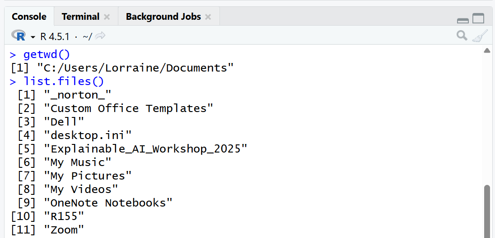

```{r setup, include=FALSE}
knitr::opts_chunk$set(echo = TRUE)
```

```{r eval=FALSE, include=FALSE}
title: "Chapter 7"
subtitle: "📤 Importing Data"
author: "by Lorraine Gaudio"  
date:   "`r paste('Version', format(Sys.Date(), '%B %d, %Y'))`"
team: "Summer 2026"
output: 
  html_document: # To create an HTML document from R Markdown
    toc: false # Table of contents (TOC)
    toc_depth: 1 #(meaning that level 1, 2, and 3 headers will be included in the table of contents
    toc_float: # Float the table of contents to the left of the main document
      collapsed: false # Collapsed (defaults to TRUE) controls whether the TOC appears with only the top-level
      smooth_scroll: true # controls whether page scrolls are animated when TOC items are navigated to via mouse clicks.
    number_sections: true # Numbering starts with "#" (H1). Without H1 headers, the H2 headers ("##") will be numbered with 0.1, 0.2, and so on.
    css: ../assets/styles.css # This is the name of the CSS file to style the HTML document with Boise State Brand. The CSS file must be in the same directory as the R Markdown file.
    fig_caption: true #Whether figures are rendered with captions.
    df_print: paged # Printing data frames with interactivne scrolling
    includes:
      in_header: ../assets/header.html
      after_body: ../assets/footer.html
      
###
title: "Chapter 7"
subtitle: "📤 Importing Data"
author: "by Lorraine Gaudio"  
date:   "`r paste('Version', format(Sys.Date(), '%B %d, %Y'))`"
team: "Summer 2026"
output: 
  pdf_document:
    toc: true
    toc_depth: 2
    number_sections: true
    citation_package: natbib
    fig_caption: true
    df_print: kable # Data frame printing
    includes:
      in_header: ../assets/header.tex
    latex_engine: xelatex  # Use xelatex to support fontspec
fontsize: 12pt
geometry: margin=1in
mainfont: "Garamond" # Sets the font of the entire document
sansfont: "Gotham-Book.otf" # Set sans-serif font to Gotham Book
monofont: "Courier New" # Set monospace font to Courier New
documentclass: scrreprt
linkcolor: boisestateblue # Customizes the color of hyperlinks
urlcolor: magenta # Customizes the color of URLs
citecolor: black # Customizes the color of citations
bibliography: references.bib # Bibliography file
biblio-style: apalike                 # ⟵ natbib needs a .bst style
natbiboptions: "round,authoryear"     # round brackets, Author (Year)
```


# Overview

In earlier chapters, you learned how to write R code, use built-in functions, and work with missing values. In this chapter you do something more realistic: you bring datasets into R the way researchers do in actual projects.

Most import problems are not “R problems.” They are **file management problems**: the file is in the wrong folder, the file name doesn’t match, or the package you need wasn’t loaded. You will learn a simple, reliable workflow: download the data, put it in the same folder as your R Notebook, confirm R can see it, and then import it with the correct function.

This chapter is also structured differently: Many of the Practice Space tasks are built into the walkthrough. If you complete each step as you go, you will finish the chapter with a working notebook that can Knit successfully and reload your datasets from a clean start.

By the end of Chapter 7, a successful student will be able to:

- 📊 Define tabular data and describe how rows and columns map to observations and variables in a data frame. (Remember/Understand)

- 📂 Explain how the working directory affects file imports and compare the working directory used in the Console vs. during Knit. (Understand/Analyze)

- 🗂️ Organize downloaded data files in the correct folder and verify file visibility using `list.files()`. (Apply)

- 📦 Install required packages once and load required packages in an R Notebook so code runs from top to bottom when knitted. (Apply)

- 💾 Load datasets from Base R and from installed packages using `data()` and confirm that the dataset is available in the Environment. (Apply)

- 📥 Import CSV and Excel files using `read_csv()` and `read_excel()` and interpret the import feedback (rows/columns and column types at a basic level). (Apply/Understand)

- 🆘 Troubleshoot common import failures (missing packages, wrong file location, wrong file name) using targeted checks (`getwd()`, `list.files()`, `library()`). (Analyze/Apply)

# Tabular data

Tabular data is data that is arranged in a table format where rows represent observations and columns represent variables. This is the most common format for datasets you analyze in R. When you import data into R, it is often stored as a data frame.

A **data frame** (df) is the most common way to store tabular data in R. It is a two-dimensional table made of rows and columns. Data frames are rectangular. Every column must have the same number of rows. In other words, each column must be the same length, because every row must have a value (or an `NA`) for every column.

Rows usually represent observations (cases, people, states, experiments, etc.). Columns usually represent variables (measurements you recorded). A data frame can store different data types in different columns (numbers, characters, logical values, etc.). A practical way to think about a data frame is a collection of columns, where each column is a vector. 
 
# Data Management

One of the most common stumbling blocks to importing data is knowing the file path. A **file path** is the “address” to a file. When you write import code, R looks for the file relative to the working directory. If R can’t find your file, it can’t import it. This is a common source of frustration for beginners. 

The first step to loading data into R is learning how to manage your files and folders so that R can find your data when you run code in the Console or an R Script and when you Knit a Notebook (*or Markdown/Quarto*).

## Working Directory

In Chapter 1, you learned how to use `getwd()` and `setwd()` to manage your working directory. This is crucial for importing data because R needs to know where to find the files you want to load.

**Running chunks interactively often uses the same session as the Console.** The real difference shows up when you Knit, because knitting runs in a fresh session and uses the Notebook file location as the working directory. That means your notebook must include everything needed to run from the top, including correct file paths.

**🎯 Goal**

Make R able to find your data files when you (1) run code in the Console and (2) when you Knit an R Notebook document.

**🎯 Goal Step 1**: Run in the Console.

```{r, eval=FALSE}
# ⚡ Type this in the Console  
getwd()  # shows current project folder
list.files()  # shows files in current folder
```

```{r, echo=FALSE, fig.cap="Image of the instructor's Console after running getwd() and list.files() as an example of an output.", out.width="75%"}

```

🗣 When ran in the Console, the file path is the working directory for RStudio. In this example, the working directory is "C:/Users/Lorraine/Documents" in the console.

**🎯 Goal Step 2**: Create an R Notebook and include the same code in a code chunk then test **Knit**.

1. Open an R Notebook Go to `File` > `New File` > `R Notebook`

2. Edit the YAML Header

```yaml
---
title: "Chapter 7 Practice"
output: html_notebook
---
```

3. Save your R Notebook `File` > `Save As...`, choose your course folder, name the file `chapter7_practice`.

4. Clear the default text and add a new code chunk with the same code as above.

5. Knit the R Notebook. 

6. Write a memo in your Notebook explaining the difference (if any) in file paths when *you* run the code in the Console vs. the Knit R Notebook. *This is Task 1 of the Practice Space at the end of this chapter.*

```{r}
# ⚡ Type this in the R Notebook code chunk
getwd()  # shows current project folder
list.files()  # shows files in current folder
```

🗣 The working directory of a R Notebook is the folder where the notebook is saved. In this example, the file path of the R Notebook file creating this HTML chapter is "C:/Users/Eva Lorraine Gaudio/OneDrive/Documents/BSU/Teaching/Data-R155/Data-R155/Module_4". The items listed includes the R Notebook itself (Chapter_7.Rmd). 

If your working directory is is set to the same location as your R Notebook, you will see the same file path and files when you run the code in the Console and when you Knit the R Notebook. If your working directory is not set to the same location as your R Notebook, you will see a different file path and files when you run the code in the Console vs when you Knit the R Notebook.

What this means for loading data is that if you are *not* using an Rmd file, you need to make sure your working directory is set to the folder where your data files are located or address the file path correctly. When you are using an Rmd file, you only need to make sure your data files are in the same folder as your Rmd file. *In Chapter 9, you will learn how to nest data files in a sub-folder.*

```{r}
# ⚡ Set your working directory to the folder where your data files are located. For example:
setwd("C:/Users/Eva Lorraine Gaudio/OneDrive/Documents/BSU/Teaching/Data-R155/Data-R155/Module_4")
```

🗣 Review Chapter 1 for more methods for setting your working directory.

For the remainder of this chapter, we will use the workflow of loading data files that are in the same folder as your R Notebook. This is a common and simple way to manage your files for data analysis projects. 

## Downloading Data

You'll need to download the two data files for this chapter from Canvas and save them in the same folder as your R Notebook.

Find the files in Canvas associated with this chapter. 

**Canvas → Modules → Module 4 → 4.01 Importing Data Guided Activity (Core; 1 hr 30 min) → Datasets**

Next, you'll need to move the downloaded files out of Downloads and into your course folder (the same folder where your notebook is saved). 

### Folder Structure

A good folder structure helps you keep track of your files and makes it easier to find what you need when you need it. In this chapter, we'll use this folder structure to make the file path simple.

-`Intro_to_R/`
-- `chapter7_practice.Rmd`
-- `Values_Transport_dplace.csv`
-- `car_prices.xlsx`

**🎯 Goal**  Download the data files for this chapter and place them in the same folder as your R Notebook. Then use `list.files()` to check that R can see the files. *This is Task 2 of the Practice Space at the end of this chapter.*

💡 **Tip:** Avoid these common mistakes

- Do not leave the files in your Downloads folder.

- Do not open the CSV in Excel (it can change formatting).

- Make sure the filenames match exactly (spelling and underscores matter).

**🎯 Goal** Check that R can see the files you downloaded by running `list.files()` in your R Notebook.

```{r, eval=FALSE}
# ✅ Type this in your R Notebook
list.files()  # shows files in current folder
```

🗣 After downloading the data files for this chapter, you should see them listed when you run `list.files()`. This means that R can find the files and you are ready to import them into R. 

💡 **Tip:** If you do not see the files listed, use File Explorer / Finder to check that you placed them to the correct folder (the same folder as your R Notebook) and that the file names are correct. 

# Import in R

This section shows you how to prepare R to import datasets. You will (1) install the packages needed for this chapter one time, and (2) load those packages every time you start a new R session so your notebook can run from top to bottom when you Knit.

## 📦 Packages refresher

To import data, we will need to use functions from additional packages that are not part of the base installation of R. A **package** is a collection of functions, data, and documentation that extends the capabilities of R. You were first introduced to the concept of packages in chapter 3 when you downloaded packages (e.g., `rmarkdown`) to run your R Notebook.

### Installing Packages

You need to download the package before you can use it. **You only need to install the package once.** *Although, packages will need to be updated from time to time.* 

**🎯 Goal:** Install the packages you need for this chapter as a *one time action*.

Method A: **GUI method to install packages.**

**Bottom-right pane → Packages tab → Install → type the package name.**

In the bottom-right **Files Pane**, you will see a tab called "Packages." This is where RStudio lists the packages you have installed. You can install packages by clicking the Install button. 


🗣 After you click Install, notice the lines of code and message(s) that result in the Console. The code is what you would have to type if you were installing packages without using the GUI (Method B).

Method B: **Type the code in the Console to install packages.**

Often times, you will use the function `install.packages()` to install a package. In this chapter, we need the packages `readr`, `readxl`, `dslabs` package, which provides functions for reading and writing data files. 

💡 **Tip:** We do not include `install.packages()` lines in knitted work. It can run during knitting, but it’s a bad practice because it is slow, unreliable, may fail on restricted machines. Use `install.packages()` in the **Console** or comment out `#` the installation code in the Notebook chunk after running once.

**🎯 Goal** Install the packages `readr`, `readxl`, and `dslabs` using `install.packages()`.

```{r, eval=FALSE}
# ⚡ Type this in your Console to install packages
install.packages("dslabs")                # You can install one package at a time
install.packages(c("readr", "readxl"))    # You use c()
```

🗣 The `install.packages()` function is used to install packages from CRAN. It is normal to see a Warning message in your console. This code installs the `dslabs`, `readr`, and `readxl` packages. The `c()` function combines the package names into a vector, allowing you to install multiple packages at once. 

```{r}
# ✅ Check
packageVersion("dslabs")
packageVersion("readr")
packageVersion("readxl")
```

🗣 After installing the packages, you can check the version of each package using the `packageVersion()` function. 

### Loading Packages

After installing the package, you need to load it into your R session using the `library()` function. This makes the functions in the package available for use. **Every time you start a new R session, you will need to load the packages you want to use.** To ensure your R Notebook works when you Knit it, you should include the `library()` calls in your R Notebook.

**🎯 Goal** Load the packages `readr`, `readxl`, and `dslabs` into your R session **using a notebook code chunk** so it load *every time* when you Knit. *This is Task 3 of the Practice Space at the end of this chapter.*

```{r}
# ⚡ Type this in your R Notebook to load packages
library(dslabs)  # For more datasets
library(readr)   # For reading CSV files
library(readxl)  # For reading Excel files
```

🗣 `library()` usually prints messages as "Warning". Warning messages from `library()` might tell you which version of the package you are using. This Warning message means that the package was successfully loaded into R. Messages will also tell you if a package failed to load. 

---

💡 **Tip:** A common error is to forget to load the package after installing it. If you try to use a function from a package that you haven’t loaded, you will get an error message saying that the function is not found. For example, if you try to use `read_csv()` without loading `readr`, you will get an error message like this:

```
Error in read_csv("data/Values_Transport_dplace.csv") : could not find function "read_csv"
```
🗣 This error means that R doesn’t know where to find the `read_csv()` function because the `readr` package hasn’t been loaded. To fix this, make sure you have the line `library(readr)` in a R Notebook code chunk *before* you try to use `read_csv()`.

---

# Loading Data

This section shows two ways datasets can enter your R session. 

1. Datasets that come with R or with a package (fast and reliable for practice).

2. External files you download (like CSV and Excel files), which require correct file names and file paths.

We'll practice both of these methods in this chapter as future chapters will rely on your ability to load either type of datasets.

## Package Datasets

To load package datasets, use the `data()` function with the name of the dataset and the package it comes from. 

📜 The basic SYNTAX: `data("dataset_name", package = "package_name")`

### Base R Datasets

Base R comes with a set of built-in `datasets` that you can use for practice and learning. These datasets are part of the base R installation and are available without needing to install any additional packages. .

**🎯 Goal:** View a list of datasets that are already in R

```{r eval=FALSE}
# ⚡ Type this in your Console to see the available datasets in base R
data(package = "datasets")
```

🗣 This opens a list of datasets that come from R by default. You can see the name of the dataset and a brief description of it. 

These dataset are already available but you can make their availability more explicit. You'll do this by loading the selected dataset into your environment using the `data()` function. Throughout the remainder of this course, we will often use `mtcars` from base R. 

**🎯 Goal:** Load the `mtcars` dataset from base R. *This is Task 4 of the Practice Space at the end of this chapter.*

```{r}
# ⚡ Type this in your R Notebook to load the mtcars dataset
data("mtcars")
```

🗣 After running this code, the `mtcars` dataset is loaded into your R environment. 

You can click the object in your environment to view the data. Alternatively, you can run the code `View(mtcars)`. Either method will open a new window in RStudio that displays the tabular data.  

💡 **Tip:** Something interesting about the `mtcars` dataset is that it has row names (labels for rows). These are not a normal “data column.” The metadata attached to the table and row names can be convenient for display, but they can also cause confusion later because they don’t behave like a regular variable. In most real projects, identifiers should be stored as a real column, not as row names.

### Curated Datasets

In addition to the base R datasets, there are packages that you can install that provide additional datasets for practice and learning. These datasets are often curated and come with documentation that explains the context and variables in the dataset. One popular package for curated datasets is `dslabs`, which provides a variety of datasets for data science education from Harvard/X data-science labs.

```{r eval=FALSE}
# ⚡ Type this in your Console to see what datasets are available from dslabs
data(package = "dslabs")         
```

**🎯 Goal:** Load the `movielens` dataset from the `dslabs` package. *This is Task 5 of the Practice Space at the end of this chapter.*

```{r}
# ⚡ Type this in your R Notebook to load the "movielens" dataset
data("movielens", package = "dslabs")
```

🗣 The `movielens` dataset from the `dslabs` package is loaded into the R environment. You can click the object in your environment to view the data.

## External Files

Often, you will need to load data from external files that you have downloaded or created. The most common file formats for data are **CSV** (`.csv`) and **Excel** (`.xlsx`). To load these files into R, you will need to use functions from the `readr` and `readxl` packages, respectively.

### Read CSV

Importing a CSV (`read_csv`) requires the package `readr` that we loaded earlier. If you forget to load (`library()`) the `readr` package first, you will get an error message when you try to use the `read_csv()` function.

Method A (optional): **Use Import Dataset to generate code**

If the file is not in your working directory, you must include a path. 

📜 The basic SYNTAX: `df <- read_csv("path/to/your/file.csv")`

There is an **GUI path** option.

**Environment pane → Import Dataset → From Text (readr) → browse your files to locate.** 
RStudio inserts code like: `df_name <- read_csv("??file_path/file_name.csv")` Look at your console to see the code that was generated. The complete file path with show in the Console.

Method B (required): **Type `read_csv()` in your notebook**

Because we are using an R Notebook, you will use the file path associated with the R Notebook location. When the CSV file is in the same folder as your R Notebook, you use the file name without a path.

`df <- read_csv("file.csv")`

**🎯 Goal:** Import the CSV file `Values_Transport_dplace.csv` into R using `read_csv()` and store it as `dplace_df`. *This is Task 6 of the Practice Space at the end of this chapter.*

```{r message=TRUE, warning=TRUE}
# ⚡ Type this in your R Notebook to import the CSV file
dplace_df <- read_csv("Values_Transport_dplace.csv")
```

🗣 The `read_csv()` function reads the CSV file and creates a data frame called `dplace_df` that contains the data from the CSV file. You can click on `dplace_df` in your environment to view the imported data. When loading, R prints an import summary to confirm what it found. The `dplace_df` contains 185 rows with 7 columns. The `Delimiter: ","` tells you it detected a comma-separated file. Column specification lists how `readr` parsed each column. In this case, `chr (3)` means 3 character columns: `id`, `name`, `sub_case` and `dbl (4)` means 4 numeric (double) columns: `domainelement_pk`, `pk`, `valueset_pk`, `year`. *Chapter 8 will teach you have to explore the data in more detail.*

💡 **Tips:** Common import problems

- “cannot open file” → run `getwd()` and `list.files()` and confirm the filename matches exactly.

- Columns look wrong → the file may not be truly comma-delimited; preview with the GUI import window to confirm the delimiter.

### Read Excel

Importing an Excel file requires the package `readxl` that we loaded earlier. If you did not load the `readxl` package, you will get an error message when you try to use `read_excel()`.

Method A (optional): **Use Import Dataset to generate code**

If the file is not in your working directory, you must include a path. 

📜 The basic SYNTAX: `df <- read_xlsx("??file_path/file.xlsx")`

The **GUI path** method described above for importing a CSV file, but select **From Excel (readxl)** instead of "From Text (readr)". 

**Environment pane → Import Dataset → From Excel (readxl) → browse your files to locate.**

Method B (required): **Type `read_excel()` in your notebook**

When using an R Notebook, you will the file path that directs from the R Notebook's folder. Saving the file in the exact same folder as your R Notebook allows you to use the file name without a path.

`df <- read_excel("file.xlsx")`

**🎯 Goal:** Import the Excel file `car_prices.xlsx` to R using `read_excel()` and store it as `car_prices_df`. *This is Task 7 of the Practice Space at the end of this chapter.*

```{r message=TRUE, warning=TRUE}
# ⚡ Type this in your R Notebook to import the Excel file
car_prices_df <- read_excel("car_prices.xlsx")
```

🗣 The `read_excel()` function reads the Excel file and creates a data frame called `car_prices_df` that contains the data from the Excel file. You can click on `car_prices_df` in your environment to view the imported data.

💡 **Tip:** If the Excel file is open on your computer, R can't load it. Always close the Excel file before trying to import it into R.

#### Multiple Sheets

Excel files can contain multiple sheets. By default, `read_excel()` reads the first sheet. If your Excel file has multiple sheets, you can specify which sheet to read using the `sheet` argument. You can specify the sheet by name or by number.

```{r}
# Optional Example
excel_sheets("car_prices.xlsx")
car_prices_sheet2 <- read_excel("car_prices.xlsx", sheet = 1)
```

🗣 The `excel_sheets()` function lists the names of the sheets in the Excel file. The `read_excel()` function with the `sheet` argument reads the specified sheet from the Excel file. In this example, `sheet = 1` reads the first sheet. You can also specify the sheet by name, for example, `sheet = "Sheet1"` or `sheet = "car_prices"` if that is the name of the sheet.


# Summary

In this chapter, you learned how datasets enter R and why file management is the most common reason imports fail. We started by defining tabular data as a table where rows represent observations and columns represent variables, and you learned that imported tabular data is usually stored in a data frame. Because data frames are rectangular, every column must have the same number of rows; when a value is missing, it should appear as NA.

You also learned how the working directory controls where R looks for files. You used `getwd()` to print the current working directory and `list.files()` to list the files R can “see” in that folder. You compared running code in the Console to Knit behavior, and you learned that knitting runs code in a fresh session, so your notebook must include everything needed to run from top to bottom, including correct file names and file locations. To prevent “cannot open file” errors, you practiced saving your downloaded data files in the same folder as your R Notebook and verifying that the filenames appear in `list.files()` before importing.

Finally, you practiced the core import workflows used throughout the course. You installed packages one time with `install.packages()` and verified installation with `packageVersion()`, then loaded packages each session with library() so your notebook can Knit successfully. You loaded datasets that come with R or packages using `data()` (for example, `data("mtcars")` and `data("movielens", package = "dslabs")`). You imported external files using `readr::read_csv()` for CSV files and `readxl::read_excel(`) for Excel files, and you learned to interpret import feedback at a basic level (rows, columns, and column types). When something did not work, you used targeted troubleshooting checks that confirmed the working directory (`getwd()`), file visibility (`list.files()`), and that packages were loaded (`library()`).


# Chapter Terms

**CSV** (Comma-Separated Values): A plain-text file (`.csv`) for rectangular (row-and-column) data where each row is a line and values are separated by commas. Because it’s plain text, CSV is widely compatible across software, but it does not reliably preserve spreadsheet features like formulas, cell formatting, or multiple sheets.

**Data Frame**: A two-dimensional R object for tabular data, organized as rows and columns. Each column is a vector (or factor) with the same number of rows, columns can have different data types, and the object has class "`data.frame`".

**Excel** (.xlsx): A Microsoft Excel workbook file (`.xlsx`) that can store one or more worksheets, along with spreadsheet features like formulas and formatting. `.xlsx` uses the Office Open XML format (the “x” indicates an XML-based file without macros).

**File Path**: A text “address” that tells the computer (and R) where a file or folder is located. Paths can be absolute (the full location from the start of the file system) or relative (interpreted relative to your current working directory). In R, `getwd()` shows the current working directory that relative paths are based on, and `file.path()` helps build paths in an operating-system-safe way.

**Graphical User Interface** (GUI): A point-and-click interface that lets you interact with software using menus, buttons, and file browsers instead of typing commands. In RStudio, the Import Dataset wizard is a GUI tool that helps you select a file and then outputs the R code (including the file path) needed to reproduce the import, so you can copy that code into your R script.

**Package**: An installable collection of R code—functions, documentation, and sometimes datasets—that adds new features beyond base R. Packages are commonly installed from CRAN and then loaded with `library()` so you can use their tools in your session.

**Tabular Data**: Data arranged in a table (a rectangular structure) where rows represent records/observations and columns represent variables/attributes. This row–column layout is the standard format used by spreadsheets, databases, and data frames.

**Working Directory**: The folder on your computer that R treats as the default “home base” for the current session. When you read files (e.g., `read.csv("data.csv")`) or save outputs (e.g., `write.csv(df, "results.csv")`) using relative paths, R looks in (and writes to) the working directory unless you specify a full path. You can view or change it using Session → Set Working Directory, and you can check it with `getwd()` or change it with `setwd("path/to/folder")`.

# 📝 Practice Space

The Practice Space is your learning check for Chapter 7. It is designed to confirm you can set up your files, load packages, and import data into R successfully.

Tasks 1–7 are integrated into the Guided Activity. If you worked through the chapter and completed each step, you have already completed Tasks 1–7. You will still list them here as a checklist so you can verify you did not miss anything.

Tasks 9–13 are multiple-choice questions that check key concepts. Complete them after you finish the guided steps.

## Task 1

Run `getwd()` and `list.files()` in your Console. Then create an R Notebook and include the same code in a code chunk then test Knit. Write a memo explaining the difference (if any) in file paths when you run the code in the Console vs the R Notebook.

## Task 2

Download the data files for this chapter and place them in the same folder as your R Notebook. Then use `list.files()` to check that R can see the files.

Files for this chapter: 

- `Values_Transport_dplace.csv`

- `car_prices.xlsx`

## Task 3

Load the packages `readr`, `readxl`, and `dslabs` into your R session.

## Task 4

Load the `mtcars` dataset from base R.

## Task 5

Load the `movielens` dataset from the `dslabs` package.

## Task 6

Import the CSV file `Values_Transport_dplace.csv` to R using `read_csv()` and store it as `dplace_df`.

## Task 7

Import the Excel file `car_prices.xlsx` to R using `read_excel()` and store it as `car_prices_df`.

## Task 8

🎯 Save your workspace (`chapter7_practice.RData`) for submission. 

This file should contain: 

- `car_prices_df` (the data frame created by importing the Excel file)

- `dplace_df` (the data frame created by importing the CSV file)

- `movielens` (the data frame created by loading the dataset from the `dslabs` package)

- `mtcars` (the data frame created by loading the dataset from base R)

## Task 9

In this course, what is tabular data?

A. A list where each element can be a different length

B. A table where rows represent observations and columns represent variables

C. A single vector that stores only numbers

D. A plot with x- and y-axes

```{r, include=FALSE}
# Correct answer: B
```

## Task 10

```{r eval=FALSE}
list.files()
```

What does the output tell you?

A. Which packages are installed on your computer

B. Which functions are available in Base R

C. Which files are in R’s current working directory

D. Which objects are stored in the Environment pane


```{r, include=FALSE}
# Correct answer: C
```

## Task 11

You click Knit and get an error that a file cannot be opened. What is the best first check?

A. Reinstall R and all packages

B. Run `getwd()` and `list.files()` to confirm where R is looking and whether the file is there

C. Prompt an LLM with the error message to get suggestions for how to fix it

D. Rename the file to something shorter

```{r, include=FALSE}
# Correct answer: B
```

## Task 12

Which function is used in this chapter to import an Excel `.xlsx` file?

A. `read_csv()`

B. `read_excel()`

C. `readxl()`

D. `readr()`

```{r, include=FALSE}
# Correct answer: B
```

## Task 13

Which function is used in this chapter to import a CSV file?

A. `read_csv()`

B. `read_excel()`

C. `readxl()`

D. `readr()`

```{r, include=FALSE}
# Correct answer: A
```