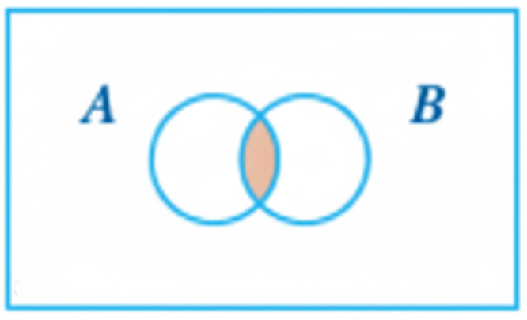

```{r setup, include=FALSE}
knitr::opts_chunk$set(echo = TRUE)
```

```{r eval=FALSE, include=FALSE}
title: "Chapter 10"
subtitle: "And, Or, and Membership"
author: "Lorraine Gaudio"
#date:   "`r paste('Version', format(Sys.Date(), '%B %d, %Y'))`"
output: 
  html_document: # To create an HTML document from R Markdown
    toc: false # Table of contents (TOC)
    toc_depth: 1 #(meaning that level 1, 2, and 3 headers will be included in the table of contents
    toc_float: # Float the table of contents to the left of the main document
      collapsed: false # Collapsed (defaults to TRUE) controls whether the TOC appears with only the top-level
      smooth_scroll: true # controls whether page scrolls are animated when TOC items are navigated to via mouse clicks.
    number_sections: true # Numbering starts with "#" (H1). Without H1 headers, the H2 headers ("##") will be numbered with 0.1, 0.2, and so on.
    css: ../assets/styles.css # This is the name of the CSS file to style the HTML document with Boise State Brand. The CSS file must be in the same directory as the R Markdown file.
    fig_caption: true #Whether figures are rendered with captions.
    df_print: paged # Printing data frames with interactivne scrolling
    includes:
      in_header: ../assets/header.html
      after_body: ../assets/footer.html
###
title: "Chapter 10"
subtitle: "And, Or, and Membership"
author: "Lorraine Gaudio"
#date:   "`r paste('Version', format(Sys.Date(), '%B %d, %Y'))`"
output: 
  pdf_document:
    toc: true
    toc_depth: 2
    number_sections: true
    citation_package: natbib
    fig_caption: true
    df_print: kable # Data frame printing
    includes:
      in_header: ../assets/header.tex
    latex_engine: xelatex  # Use xelatex to support fontspec
fontsize: 12pt
geometry: margin=1in
mainfont: "Garamond" # Sets the font of the entire document
sansfont: "Gotham-Book.otf" # Set sans-serif font to Gotham Book
monofont: "Courier New" # Set monospace font to Courier New
documentclass: scrreprt
linkcolor: boisestateblue # Customizes the color of hyperlinks
urlcolor: magenta # Customizes the color of URLs
citecolor: black # Customizes the color of citations
bibliography: references.bib # Bibliography file
biblio-style: apalike                 # ⟵ natbib needs a .bst style
natbiboptions: "round,authoryear"     # round brackets, Author (Year)
```


# Overview

In Chapter 8, you learned how bracket subsetting works: `df[rows, cols]` lets you extract and modify exactly the pieces of a data frame you need. This chapter strengthens that skill by adding three essential logical operators to your toolkit: `&` (AND), `|` (OR), and `%in%` (in set). Most real analysis questions require more than one condition—“keep rows where X is true and Y is true,” or “keep rows where A or B is true,” or “keep rows where a value is one of several allowed options.” You will practice translating those English rules into correct R code using logical tests (`>`, `<`, `==`, `!=`) combined with `&`, `|`, and `%in%`, then verify your results so you catch silent errors early—especially precedence bugs that happen when mixed operators are missing parentheses.


By the end of Chapter 10, you will be able to:

- ✂️ Apply bracket subsetting x[i, j] to select or exclude rows and columns by position.

- ⚖️ Generate and interpret logical vectors using relational operators (`>`, `<`, `<=`, `>=`, `==`, `!=`) on data-frame columns accessed with `$`. 

- 🔍 Use logical vectors inside `[ ]` to filter rows based on conditions. 

- 🔄 Explain and use logical negation with `!` to invert tests.

- 🧺 Combine multiple filtering conditions using `&` (AND), `|` (OR), and `%in%` (membership) to construct multi-criteria subsets.

- 🩹 Diagnose and correct a precedence bug by adding grouping parentheses.

- 🚜 Construct readable, reproducible multi-condition filters with clear comments.

Keep these goals in mind as you move through each section.

# Set Up

To begin this guided activity, you'll want to open a new R Notebook in your course folder named `chapter10_notes.Rmd`. Update the YAML header with the title, author, and date. You can copy the YAML header from this document, and fill in your name. 

```{r echo=FALSE, results='asis'}
cat("```yaml
---
title: \"Chapter 10 Notes: And, Or, and Membership\"
author: \"Your Name Here\"
date: \"`r Sys.Date()`\"
output: html_notebook
---
```")
```

# Load Data

 We will use the built-in 🚗 `mtcars` dataset for this guided activity. 

```{r , eval=FALSE}
# ⚡ Type this in your R Notebook
data("mtcars")
```

🗣 The `data()` function loads built-in datasets into the environment. 

## Basic Data Inspection

After loading data, it's good practice to inspect it.

🎯 **Goal:** Get a quick sense of the data structure using built-in functions.

```{r , eval=FALSE}
# ⚡ Type this in your R Notebook
?mtcars      # help file (opens in Help tab)
View(mtcars) # spreadsheet view (top-left pane)
```

🗣 The help tab shows the structure of the dataset, variable descriptions, and source information. 

 Let's used the subsetting skills you learned in Chapter 8 to quickly check the structure of `mtcars`.

---

📖 Review: Subsetting template

📜 The SYNTAX:  `x[i, j]` where `i` is the **row index**, `j` is the **column index**.

- Leave `ROWS` blank → keep all rows.

---

🎯 **Goal:** Get a quick sense of the data structure and content using subsetting `x[i, j]`.

```{r}
mtcars[1:6, ] 
```

🗣 The blank after the comma means "keep all columns". This returns the first 6 rows of `mtcars` with all columns. This subset provides the same information as `head(mtcars)`.

# Exclude Columns and Rows

Instead of keeping rows/columns by position or condition, you can also drop them. This is often done with negative indices or with logical conditions that create `TRUE`/`FALSE` vectors.

## Negative Indices

**Negative indexing** drops rows or columns by position. Inside the bracket subsetting operator `[` for vectors/matrices/data frames, a negative integer index means “leave these positions out.”

📜 The SYNTAX:  `x[-i, -j]`

Using negative indices drops row/column by position.

🎯 **Goal:** Drop the last two columns of `mtcars` (columns 8 and 9) to create a new dataframe `no_cat` that contains only numeric variables.

```{r}
# ⚡ Type this in your R Notebook
no_cat <- mtcars[ , -c(8, 9)]   
# ✅  Verify
head(no_cat)
```

🗣 The `-c(8, 9)` is the integer vector containing `-8` and `-9`. Negative column indices mean: drop column 8 and drop column 9. The blank before the comma, `i` is empty → all rows. For `mtcars`, columns 8 and 9 are `vs` and `am`, respectively. So `mtcars[ , -c(8, 9)]` returns all rows and all columns except `vs` and `am`.

💡 **Tip:** With integer indexing, you generally use all positive indices (keep these) or all negative indices (drop these). Mixing them triggers the classic error (“only 0’s may be mixed with negative subscripts”).

The use of the negative sign `-` is one way to subset by excluding columns. However, the most powerful way to subset dataframes is with logical operators that create `TRUE`/`FALSE` vectors. 

## Inequality `!=`

**Conditional subsetting** with logical (relational) operators is more flexible than negative indexing because you can specify conditions on the values in the data frame, not just positions. Recall from Chapter 8 that logical tests create `TRUE`/`FALSE` vectors used inside of `[ ]`.

**Not Equal To** (`!=`) is a relational operator that compares values and returns a logical vector of `TRUE`/`FALSE` results. When the element value is not equal to the specified value, the result is `TRUE`. When the element value is equal to the specified value, the result is `FALSE`. The result is the opposite of the `==` operator, which tests for equality.

🎯 **Goal:** Use `!=` to create a logical vector that is `TRUE` where the number of cylinders (`cyl`) is NOT equal to 4.

```{r}
# ⚡ Type this in your R Notebook
mtcars$cyl != 4       
```

🗣 This does not return a subset. It produces **a logical vector** you can use for subsetting, typically rows. In this example, the code returns a logical vector with `TRUE` where the number of gears is anything but 4 and `FALSE` otherwise.

---

📖 **Review:** Accessing Columns with `$` 

- `$` extracts a single column as a vector. 

- 📜 The SYNTAX: `dataframe$column_name`

🎯 **Goal:** Use `$` to access the `cyl` column of `mtcars` as a vector.

```{r}
# 📖 Review
mtcars$cyl
```

🗣 The `$` operator is used to access ONE specific column in a data frame by name. The column name is `cyl` and it tells the number of cylinders 4, 6, or 8 for each car. The vector lists the values in `cyl` in row order. The `TRUE` and `FALSE` vector returned from `mtcars$cyl != 4` returned `TRUE` when the value did not equal 4. 

For example, the first value 6 is `TRUE` because 6 is not equal to 4. The second value 6 is also `TRUE` because 6 is not equal to 4. The third value 4 is `FALSE` because 4 is equal to 4. 

---

🎯 **Goal:** Use the logical test `!= 4` inside `[ ]` to keep only rows where `cyl` is NOT equal to 4.

```{r}
# ⚡ Type this in your R Notebook
not4 <- mtcars[mtcars$cyl != 4, ]
# ✅ Verify
head(not4)
```

🗣 This returns **a subset** of `mtcars` with all rows where the number of cylinders is anything but 4 and all columns. When the logical test returned `TRUE`, the row is selected. When the logical test returned `FALSE` the row is removed from the output. 

## Not `!`

The **Not** operator `!` negates a logical value. `!TRUE` becomes `FALSE`, and `!FALSE` becomes `TRUE`. It can be used to flip the result of a logical test.

🎯 **Goal:** Use `!` to create a logical vector that is `TRUE` where the number of cylinders (`cyl`) is NOT equal to 4.

```{r}
# ⚡ Type this in your R Notebook
not4_bang <- mtcars[!(mtcars$cyl == 4), ]
head(not4_bang)
```

🗣 `!(x == 4)` and `x != 4` mean the same thing! `!=` is a direct “not equal” comparison. `!` is more general. It negates a logical test. Here, `!(mtcars$cyl == 4)` reads as “NOT (cyl equals 4)”, which is equivalent to “cyl not equal to 4”.

🎯 **Goal:** Verify that the `!` version of the subset matches the `!=` version.

```{r}
# ✅ Verify it matches the != version
head(not4_bang == not4)
```

🗣 The two subsets are the same. 

The `!` version is more flexible because you can negate *any* logical test, not just equality. 

---

In summary, **negative indices** `-` excludes rows/columns by position only. The **inequality** `!=` operator compares values and returns `TRUE`/`FALSE` (great for filtering rows). The **not** `!` operator negates any logical test. **Not** is great for more complex logical tests such as element-by-element or membership logical operators covered later in this chapter.

## Practice Relational Operators

Before we dive into complex logical tests, lets make sure we understand how we can combine these relational operators together. So far in this chapter, we have used the logical operators `==`,  `!=`, and `!`. Let's practice using the relational operators in combination with subsetting.

### Example 1

The **Less Than or Equal To** (`<=`) operator returns `TRUE` where the left side is less than or equal to the right side, and `FALSE` otherwise.

🎯 **Goal:** Answer the question, "How many cars in the dataset have `mpg ≤ 15`?" Use a logical test to count how many cars have miles per gallon less than or equal to 15.

```{r}
# ⚡ Type this in your R Notebook in a code chunk
sum(mtcars$mpg <= 15)
```

🗣 The logical test `<= 15` evaluates each row value in the column `mpg` in the `mtcars` dataset (`mtcars$mpg`). If the car in a row has a value less than or equal to 15, the result is `TRUE`, otherwise `FALSE`. In R, `TRUE` is treated as `1` and `FALSE` as `0`. The function `sum()` adds all the `TRUE` values. There are 6 cars in the `mtcars` dataset with mile per gallon less than or equal to 15.

### Example 2

The **Greater Than or Equal To** (`>=`) operator returns `TRUE` where the left side is greater than or equal to the right side, and `FALSE` otherwise. We can combine this operator with negative indexing to create a subset of the data frame.

🎯 **Goal:** Create a subset of `mtcars` that contains rows with `hp >= 100`, and drops columns `3`, `5`, and `8:9` by position. 

```{r}
# ⚡ Type this in your R Notebook in a code chunk
selection <- mtcars[mtcars$hp >= 100, -c(3, 5, 8:9)]
# ✅  Verify
head(selection)
```

🗣 `mtcars$hp >= 100` keeps only rows where horsepower is at least 100. The `-c(3, 5, 8:9)` part drops columns 3, 5, 8, and 9 from the result (i.e., it removes those column positions).

💡 **Tip:** A common mistake is to forget which side the `>`, `<` goes to the `=`. Remember that the `=` is always on the *right side* of the operator. 

✔️ **`>=`** 

🚫 **`=>`** 

### Example 3

We can also verify that we got the expected number of columns in our subset by passing the stored object names through functions (like `ncol()` counts columns) and then compare the results with `==`.

🎯 **Goal:** Verify that `selection` has the expected number of columns (i.e., 7 columns, since we dropped 4 from the original 11).

```{r}
# ✅  Verify
ncol(selection) == ncol(mtcars) - length(c(3, 5, 8:9))
```

🗣 This checks whether the subset has **exactly the expected number of columns** after dropping columns 3, 5, 8, and 9. 

- `ncol(selection)` counts the number of columns in the `selection` data frame.

- `ncol(mtcars)` counts the number of columns in the original `mtcars` dataset (which is 11).

- `length(c(3, 5, 8:9))` counts how many columns we dropped (which is 4). *Note that we could have written it as `c(3, 5, 8, 9)`.*

- The `ncol(mtcars)` (11) minus `length(c(3, 5, 8:9))`(4) gives us the expected number of columns in `selection` (which is 7).  

If it returns `TRUE`, we removed the right columns (7 remaining); if it returns `FALSE`, something went wrong (e.g., wrong column positions, accidental extra drops). 

💡 **Tip:** For a data analyst, doing quick verification steps to prevent silent errors before modeling or reporting. We need to ensure our dataset structure matches our assumptions so downstream results aren’t based on the wrong variables.


The next section introduces three new logical operators that help with more complex conditions: `&` (and), `|` (or), and `%in%` (in set).

# `&`, `|`, `%in%`

Up to this point, you have used single logical tests inside brackets to pick rows (for example, `mtcars[mtcars$mpg <= 15, ]`). That works when your filter has one requirement.

What if we have multiple requirements?

- “I want cars that are automatic **AND** have mpg ≤ 22.”

- “I want cars with 4 **OR** 8 cylinders.”

- “I want cylinders in the set {4, 6}.”

This section adds three new primary operators to our R toolkit. 

- `&` means **AND** and checks that both conditons are true.

- `|` means **OR** and check if at least one condition is true

- `%in%` means membership (**in set**) and checks is a value is within a set


These operators allow us to combine multiple conditions for more complex subsetting.

Here is a summary table showing primary logical operators.

| Operator | Meaning | Example  |
| -------- | ------- | ------------|
| `>`      |greater than| mpg **`>`** 20|
| `<`      |less than| mpg **`<`** 15|
| `==`     | equal to | am **`==`** 1|
| `>=`     |greater *or* equal|mpg **`>=`** 25|
| `<=`     |less *or* equal   |mpg **`<=`** 15|
| `!`      | not     | **`!`**(gear %in% c(3,4))  |
| `!=`     | not equal to| gear **`!=`** 4|
| **`&`**  |  and    | x > 2 **`&`** y == "a" |
| **`|`**  |  or     | cyl == 4 **`|`** cyl == 8 |
| **`%in%`**| in set  | region **`%in%`** c("West", "South") |

Let's explore each of these three new operators in more detail. In this section, we'll build multiple logical tests on columns, combine tests with `&` and `|` to form a single condition, and use `%in%` to match one of many allowed values. 

## And `&`

Suppose we have two events: A and B. The **And** operator `&` returns `TRUE` only if **both** event A and event B are **true**. It returns `FALSE` if either event A or event B (or both) are false. The "and" is used to combine two or more conditions where all conditions must be true.

```{r , out.width='40%', fig.align='center', alt.cap='Venn diagram showing "and" operation', echo=FALSE}

```

🎯 **Goal:** filter `mtcars` to keep cars that are both automatic (`am == 0`) *and* have the average miles per gallon is less than or equal to 22.

**Step 1:** Create two separate logical vectors for each condition.

```{r}
# ⚡ Type this in your R Notebook in a code chunk
is_auto <- mtcars$am == 0
mpg_22_or_less <- mtcars$mpg <= 22

# ✅ Verify: look at the first few TRUE/FALSE values
head(is_auto)
head(mpg_22_or_less)
```

🗣 Two logical vectors are created. `is_auto` is `TRUE` where the car has automatic transmission (`am == 0`) and `FALSE` where it has manual transmission (`am == 1`). `mpg_22_or_less` is `TRUE` where the miles per gallon is less than or equal to 22, and `FALSE` otherwise.

**Step 2:** Combine the two logical vectors with `&` to create a single condition that is `TRUE` only where both conditions are met.

```{r}
# ⚡ Combine conditions (row-by-row)
keep_rows <- is_auto & mpg_22_or_less

# ✅ Verify
head(keep_rows)
sum(keep_rows)   # how many rows will be kept?
```

🗣 The `keep_rows` vector is `TRUE` only where both `is_auto` and `mpg_22_or_less` are `TRUE`. The `sum(keep_rows)` counts how many rows satisfy both conditions.

**Step 3:** Use the combined logical vector to subset the data frame. 

```{r}
# ⚡ Subset the data
auto_mpg_22_or_less <- mtcars[keep_rows, ]

# ✅ Verify
head(auto_mpg_22_or_less)
```

🗣 The `auto_mpg_22_or_less` is a subset data frame of `mtcars` that contains only rows where the car is automatic and has miles per gallon less than or equal to 22.

Alternatively, you can combine the conditions directly inside the subset without creating intermediate logical vectors.

```{r , eval=FALSE}
# ⚡ Type this in your R Notebook in a code chunk
auto_mpg_22_or_less <- mtcars[ mtcars$am == 0 & mtcars$mpg <= 22 , ]
```

🗣 Use `&` when you want rows that satisfy all requirements at the same time. Both `mtcars$am == 0` and `mtcars$mpg <= 22` must meet the condition to be `TRUE`. 

```{r , eval=FALSE}
# ✅ Verify 
head(auto_mpg_22_or_less)
```

```{r , eval=FALSE}
# ✅ Verify 
nrow(auto_mpg_22_or_less)
```

🗣 `&` is the correct operator for the creation of `auto_mpg_22_or_less` because we want cars that are *both* automatic and have mpg less than or equal to 22. `&` is strict. It requires *everything* to be true.

💡 **Tip:** Students often write one condition correctly and “half-write” the other, like: `mtcars$am == 0 & mpg <= 22` ← wrong because mpg is not defined by itself here.  Both sides of `&` must be complete logical tests.

## Or `|`

Suppose we have two events: A and B. The **Or** logical operator `|` returns `TRUE` if either **event A** is true, **event B** is true, **or both** events are **true**. It only returns `FALSE` if both events are false. "Or" is inclusive and is used to combine two or more conditions where at least one condition must be true.

```{r , out.width='40%', fig.align='center', alt.cap='Venn diagram showing inclusive "or" operation', echo=FALSE}
knitr::include_graphics("Or.png")
```

Use `|` when you want rows that satisfy at least one requirement. The `|` is located above the Enter key on your keyboard. It is the vertical bar and shares the key with the backslash `\`. Click and hold the Shift key to type `|`.

🎯 **Goal:** keep rows (cars) that with either 4 *or* 8 cylinders.

```{r , eval=FALSE}
# ⚡ Type this in your R Notebook in a code chunk
four_or_eight <- mtcars[mtcars$cyl == 4 | mtcars$cyl == 8, ]
```

```{r , eval=FALSE}
# ✅ Verify 
head(four_or_eight)
```

```{r , eval=FALSE}
# ✅ Verify 
unique(four_or_eight$cyl)
```

🗣 The Or `|` operator checks element-by-element to return only cars that have either 4 or 8 cylinders.

💡 **Tip:** Sometimes students mix up when to use `|` where they meant `&` (or vice‑versa). Try saying the filter outloud before coding.

- "I want rows that are both A **and** B" are TRUE at the same time. 👉 use `&` 

- "I want rows where at least one (A **or** B") is TRUE. 👉 use `|`

## Membership `%in%`

**OR** becomes annoying when you have many options. The **in set** `%in%` operator tests if values belong to a set (vector). It is a shorthand for multiple OR `|` conditions. This is "the scalable OR operator" when you have many values to match.

The `%in%` in `x %in% c(a, b, c)` means "For each value in `x`, is it one of these allowed values?" It returns a logical vector (`TRUE`/`FALSE`) the same length as `x`. 

🎯 **Goal:** Same task as the `|` example but this time with `%in%`. 

```{r , eval=FALSE}
# ⚡ Type this in your R Notebook in a code chunk
four_or_eight_2 <- mtcars[mtcars$cyl %in% c(4, 8), ]
```

```{r , eval=FALSE}
# ✅ Verify: same number of rows as the | version
nrow(four_or_eight) == nrow(four_or_eight_2) 
```

🗣 When matching many categories, `%in%` is easier than chaining many `|`statements. `%in% prevents repetitive OR chains. The `%in%` stays readable when the list is long. 


🎯 **Goal:** Use `%in%` to filter `mtcars` for cars with 4, 6, or 8 carburetors.

```{r , eval=FALSE}
# ⚡ Tesype this in your R Notebook in a code chunk
carb_4_6_8 <- mtcars[mtcars$carb %in% c(3, 4, 6, 8), ]
```

```{r , eval=FALSE}
# ✅ Verify
head(carb_4_6_8)
```

🗣 If we had used `|` instead of `%in%`, we would have had to write `mtcars$carb == 3 | mtcars$carb == 4 | mtcars$carb == 6 | mtcars$carb == 8`, which is much more verbose and harder to read.

💡 **Tip:** A common mistake with `%in%` is mixing the order. 

- `c(4, 8) %in% mtcars$cyl` is ⚠️ invalid code, wrong meaning for filtering rows

- use the `x %in% c(a, b, c)` format for subsetting rows. The left side is the column you are testing, and the right side is the set of allowed values.

___

Now that we have these three tools for building row filters, we can combine them to create more complex conditions.

# Putting `&`, `|`, `%in%` Together

In this section, you’ll practice combining `&`, `|`, `%in%` into realistic filters. The hard part is not typing the operators—it’s making sure your code matches the sentence you think you wrote.

## Grouping Parentheses

When we combine multiple conditions with `&` and `|` or `%in%`, we need to make sure the code matches the sentence we think it does. Use **grouping parentheses** when mixing `&` and `|` to make intent explicit. Without grouping parentheses, we can trigger a **precedence bug**, where R groups a mixed `&`/`|` filter by its precedence rules (treating `a & b | c` as `(a & b) | c`) instead of the logic we intended (`a & (b | c)`). The **grouping parentheses** overrides the operator precedence.

> **Add parentheses to show what the OR part is.**

Let's see how the parentheses changes which rows are selected. 

🎯 **Goal:** Keep automatic transmission cars (0 = automatic) and either are very efficient (`mpg ≥ 25`) or very light (`wt < 2.5`, i.e., < 2500 lb).

We'll write this with and without parentheses to see the difference.

```{r}
# ⚡ Type this in your R Notebook in a code chunk
maybe_wrong <- mtcars[ mtcars$am == 0 & mtcars$mpg >= 25 | mtcars$wt < 2.5 , ]
head(maybe_wrong)
```

🗣 The statement was evaluated like this: (`mtcars$am == 0 & mtcars$mpg >= 25`) OR `mtcars$wt < 2.5`. This means that we kept cars that are both automatic and very efficient, or we kept cars that are very light. This is not our defined goal.

```{r}
# ⚡ Type this in your R Notebook in a code chunk
intended <- mtcars[ mtcars$am == 0 & (mtcars$mpg >= 25 | mtcars$wt < 2.5) , ]
head(intended)
```

🗣 The statement was evaluated like this: `mtcars$am == 0` AND (`mtcars$mpg >= 25 | mtcars$wt < 2.5`). This means that we kept cars that were automatic and either are very efficient or very light. That's our goal! 


⚖️ Compare the number of rows in `maybe_wrong` to `intended`.

```{r , eval=FALSE}
# ✅ Verify
nrow(maybe_wrong) == nrow(intended)
```

🗣 The parentheses matter when mixing `&` and `|` because parentheses clarify the order of operations. Without parentheses, the expression is evaluated left to right, which can lead to unintended results. With parentheses, we ensure that the conditions within them are evaluated first.

### Muli-Conditon Filter

The previous example was about controlling meaning. Now you’ll apply that idea to a filter that looks like something you’d actually do in analysis: restrict the dataset using several criteria at once.

🎯 **Goal:** Pick cars that weigh < 3,000 lb, have horse power between 110 and 180, and cylinders {4,6}.

*In `mtcars`, weight is in units of 1000 lbs, so we want `wt < 3`.* 

💡 **Tip:** Before coding, translate the goal into a single sentence that matches the logic you want. "I want cars that are light (wt < 3) **AND** have mid-range horsepower (110 ≤ hp ≤ 180) **AND** have either 4 OR 6 cylinders."

```{r}
# ⚡ Type this in your R Notebook in a code chunk
light_midpower <- mtcars[
    mtcars$wt < 3 &           
    mtcars$hp >= 110 & mtcars$hp <= 180 &
    mtcars$cyl %in% c(4, 6), ]
```

🗣 We wrote each condition on a separate line for readability, but they are combined into a single filter. By having one condition per line, we can visually identify the logical arguments. When you click "Enter" (Return), R automatically indents. 


```{r}
# ✅ Verify
head(light_midpower)
```


```{r}
# ✅ Verify
range(light_midpower$hp)
```

The code selected rows with horsepower between 110 and 180.

```{r}
# ✅ Verify
unique(light_midpower$cyl)
```

The code selected rows with 4 or 6 cylinders.

```{r}
# ✅ Verify
all(light_midpower$wt < 3)
```
The code selected rows with weight under 3 (i.e., under 3000 lbs).

---

By this point, you should be able to translate a real-world rule into a logical filter, use parentheses to prevent a precedence bug, and confirm that your subset matches your intent with quick verification checks. Next, we’ll step back and summarize the core subsetting and logic skills you practiced in this chapter and why they matter for reliable analysis.


# Summary

You learned how to subset data frames more precisely by building logical tests and using them inside `df[rows, cols]`. You practiced excluding columns with negative indexing, filtering rows with relational operators like `!=`, and negating logical tests with `!`. You then added three high-impact operators: `&` to require multiple conditions at the same time, `|` to accept at least one condition, and `%in%` to match values that belong to a set without writing long OR chains. Most importantly, you learned to prevent a precedence bug by using grouping parentheses whenever you mix `&` and `|`, so the code matches the sentence you intended. If you can state your rule clearly, write the logical filter cleanly, and verify the output with quick checks (`nrow()`, `unique()`, `range()`, `all()`), you can trust that the subset you pass into later analysis is the right one.

# Chapter Terms

**And** (`&`): An element-by-element logical operator that returns `TRUE` only where both conditions are `TRUE`; otherwise it returns `FALSE` (or `NA` when the result can’t be determined because of missing values).

**Conditional Subsetting** (Logical Subsetting): Filtering an object by using a logical condition inside [ (e.g., `df[df$cyl != 4, ]`), where `TRUE` keeps an element/row and `FALSE` drops it. This contrasts with negative indexing, which excludes by position rather than by a condition.

**Equal To** (`==`): A relational operator that tests equality and returns `TRUE` where values are equal and `FALSE` where they are not (element-by-element for vectors).

**Greater Than** (`>`): A relational operator that compares two values (or vectors) and returns a logical vector that is `TRUE` where the left side is greater than the right side, and `FALSE` otherwise (with `NA` if the comparison is unknown).

**Greater Than or Equal To** (`>=`): A relational operator that returns `TRUE` where the left side is greater than or equal to the right side, and `FALSE` otherwise.

**Grouping Parentheses**: Parentheses `(` `)` used to explicitly group parts of an expression so R evaluates them together, in the order you intend, rather than relying on operator precedence and associativity rules. This is especially important when mixing logical operators like `&` and `|`, where missing parentheses can change the meaning of your filter.

**In Set** (`%in%`): A membership operator that returns a logical vector indicating whether each element on the left appears anywhere in the vector on the right (e.g., `region %in% c("West","South")`)

**Inequality Operator** (`!=`): A relational (comparison) operator that tests whether values are not equal and returns a logical vector (`TRUE`/`FALSE`) element-by-element (e.g., `x != 4`). By itself it doesn’t drop anything—it creates a condition you can use for subsetting.

**Less Than** (`<`): A relational operator that returns `TRUE` where the left side is less than the right side, and `FALSE` otherwise (vectorized across elements).

**Less Than or Equal To** (`<=`): A relational operator that returns `TRUE` where the left side is less than or equal to the right side, and `FALSE` otherwise.

**Negative Indexing**: Using negative integers inside the single bracket operator `[` to exclude elements (or rows/columns) by position (e.g., `x[-2]` drops the 2nd element; `df[ , -c(8, 9)]` drops columns 8 and 9). In base R, negative and positive indices can’t be mixed in the same subset (except `0`)

**Not** (`!`): A logical operator that negates a logical value: `!TRUE` becomes `FALSE`, and `!FALSE` becomes `TRUE` (and `!NA` remains `NA`).

**Not Equal To** (`!=`): A relational operator that returns `TRUE` where values differ and `FALSE` where they match (vectorized across elements).

**Or** (`|`): An element-by-element logical operator that returns `TRUE` where either condition is `TRUE`; otherwise it returns `FALSE` (or `NA` when the result is ambiguous due to missing values).

**Precedence Bug**: An error where a mixed-operator expression is grouped and evaluated differently than intended because R applies operator precedence rules when parentheses are missing. In R, & binds more tightly than |, so `a & b | c` is interpreted as `(a & b) | c` unless you add parentheses to force `a & (b | c)`.

# 📝 Practice Space

In this Practice Space, you will practice writing logical filters for data frames using bracket subsetting (`df[rows, cols]`) and the operators you learned in this chapter:

- relational operators (`<`, `<=`, `>=`, `==`, `!=`)

- logical operators (`&`, `|`)

- membership (`%in%`)

- indexing with `which()`

You’ll apply these skills to an **NGO health pilot** scenario using the `gapminder` dataset to narrow thousands of rows down to a short, defensible shortlist.

**How to complete and submit**

1. Open a new R Notebook and save it in your course folder as: chapter10_practice.Rmd. Edit the YAML so that it includes the title "Chapter 10 Practice", your name as the author, and the date. Remove the default content in the R Notebook. Create heading for each task. 

2. Work through each task in order. Replace every ___ with code or a short written answer.

3. Run each completed chunk as you go. After each task, check that new objects (like `focus_pool`, `brief_sheet`, `needs_screen`) appear in the Environment.

4. Knit your R Notebook to HTML. Submit the HTML file (not the .Rmd).

**NGO Health Pilot** 🌍💉

Imagine your nonprofit received 100 vaccine coolers and one charter flight. You must assemble a shortlist of countries for a health-equity pilot within the next few weeks. Use dslabs::gapminder to (a) focus on specific regions, (b) filter by need indicators, and (c) apply a simple feasibility window based on population size.

🚀 Setup & Orientation

🎯 **Goal:** Load the data, read the help page, and become familiar with the `gapminder` dataset.

We installed the package `dslabs` in Chapter 7. `dslabs` has curated datasets from Harvard/X data-science labs for data science education. 

```{r , eval=FALSE}
# ⚡ Type this in your R Notebook in a code chunk

# install.packages("dslabs")  # uncomment if you have not yet installed dslabs
## NOTE: Please comment out the install.packages() line after you run it once. Your report will not knit with install.packages() in it.  You only need to install the package once per computer.

# Load the package and data
library(dslabs)  # use library() to load the package

gapminder <- dslabs::gapminder  # load the dataset "gapminder"

?gapminder   # pull up gapminder in the help window
```


```{r ,eval=FALSE}
colnames(gapminder)   # use colnames() to list names of the columns in gapminder
```

🗣  How many rows are in gapminder?

## Task 1 🌱

📅 Pick a Year

🎯 Identify the years present in the data, store the 2010 as `target_year`.

**Step 1** Use `unique()` to print the available `year` in `gapminder`.

```{r ,eval=FALSE}
# ⚡ Type this in your R Notebook, Fill in the blanks
# TODO 1‑A: list years
unique(gapminder$___)   # see unique `year` in `gapminder`
```

**Step 2** Store 2010 as `target_year`.

```{r , eval=FALSE}
# ⚡ Type this in your R Notebook, Fill in the blanks
# TODO 1‑B: Select the 2010 year
target_year <- ___   # must be a single year of gapminder
```

🗣 *We use 2010 because it has the most complete data*

## Task 2 🌱

🧭 Pick your regions

🎯 Identify the exact region names; then pick (your choice) your three target regions.

**Step 1** Identify the `unique` `region` options in `gapminder`.

```{r , eval=FALSE}
# ⚡ Type this in your R Notebook, Fill in the blanks
# TODO 2-A: Show all region options
___(___$___)    # Fill in: function, dataset, and column name  
```

*Use this output to select three regions. Copy exact names.*

**Step 2** 


```{r , eval=FALSE}
# ⚡ Type this in your R Notebook, Fill in the blanks
# TODO 2-B: store three regions EXACTLY as shown above
region_1 <- "___"
region_2 <- "___"
region_3 <- "___"
```

🗣 I selected ____, ____, and ____ as my target regions because _____.

## Task 3 🌱

🔍 Focus the Pool

🎯 Create `focus_pool` that keeps rows from the `target_year` AND restricts to three regions you want to prioritize. 

**Step 1** Build the logical tests for year and region separately.

```{r , eval=FALSE}
# ⚡ Type this in your R Notebook, Fill in the blanks
# TODO 3-A: build the logical tests (two separate vectors)

is_year   <- gapminder$year __ target_year  # test for equality

is_region <- _________$region ___ c(region_1, region_2, region_3)  # test for membership in the set
```

**Step 2** Combine the two logical vectors with `&` to create a single filter.

```{r , eval=FALSE}
# ⚡ Type this in your R Notebook, Fill in the blanks
# TODO 3-B: combine
keep <- _______ _ _______           # is_year and is_region with AND

```

**Step 3** Use the combined logical vector to subset `gapminder` and create `focus_pool`.

```{r , eval=FALSE}
# ⚡ Type this in your R Notebook, Fill in the blanks
# TODO 3-C: subset 
focus_pool <- gapminder[____, ____] # subset rows with keep, keep all columns
```

🗣 Describe what `%in%` and `&` are doing here, and why you used `$` with column names.

EXPLANATION: "___"

Compare the number of rows in `gapminder` with the number of rows in `focus_pool`

```{r , eval=FALSE}
# ⚡ Type this in your R Notebook, Fill in the blanks
# TODO 2-D: Compare number of rows in focus_pool with the original dataset
____(focus_pool) __ ____(gapminder)     
```

🗣 How do the number of rows in `focus_pool` compare to `gapminder`?

## Task 4 🌱

🗂 Negative Indices

Create a simpler briefing table `brief_sheet` by dropping exactly columns by position (not by name). 

Use negative indexing to drop the columns 7, 8, and 9 from `focus_pool`. 

```{r , eval=FALSE}
# ⚡ Type this in your R Notebook, Fill in the blanks
brief_sheet <- focus_pool[ , ___(7, 8, 9) ]    # use negative c() 
# ✅ Verify
names(______)
```

🗣 Explain how negative indices work for column selection.

EXPLANATION: “___”

*The `brief_sheet` is a simpler table with only the columns that have data. This makes it easier to inspect the indicators we care about in the next task.*

## Task 5 🌱

🎯 In task 6, you will identify countries that need the health pilot the most. You will use three indicators as filters: `life_expectancy`, `infant_mortality`, and `fertility`. Before you set thresholds for these indicators, you should inspect the range of values to make informed decisions.

🔢 Inspect before choosing thresholds

### Life Expectancy (a)

**Step 1** Use `range()` to inspect the range of values in `life_expectancy`

```{r, eval=FALSE}
# ⚡ Type this in your R Notebook, Fill in the blanks
# The value `a` in Task 6 will be based on this range and count.
range(brief_sheet$life_expectancy, na.rm = ____)
```

🗣 The range of life expectancy in `brief_sheet` is from ___ to ___ years.

**Step 2** Use `sum()` to count how many countries have life expectancy above a certain threshold (e.g., 70 years). Select a value within the range you found in Step 1.

```{r , eval=FALSE}
# ⚡ Type this in your R Notebook, Fill in the blanks
# The value `a` in Task 6 will be based on this range and count.
sum(brief_sheet$life_expectancy <= ___, na.rm = TRUE)  
```

🗣 There are ___ countries with life expectancy above ___ years.

### Infant Mortality (b)

**Step 3** Use `range()` to inspect the range of values in `infant_mortality`

```{r, eval=FALSE}
# ⚡ Type this in your R Notebook, Fill in the blanks
# The value `b` in Task 6 will be based on this range and count.
range(brief_sheet$__________, na.rm = TRUE)
```

🗣 The range of infant mortality in `brief_sheet` is from ___ to ___ deaths per 1000 live births.

**Step 4** Use `sum()` to count how many countries have infant mortality above a certain threshold (e.g., 35 deaths per 1000 live births). Select a value within the range you found in Step 3.

```{r , eval=FALSE}
# ⚡ Type this in your R Notebook, Fill in the blanks
# The value `b` in Task 6 will be based on this range and count.
sum(brief_sheet$infant_mortality >= ___, na.rm = TRUE)
```

🗣 There are ___ countries with infant mortality above ___ deaths per 1000 live births.

### Fertility (c)

**Step 5** Use `range()` to inspect the range of values in `fertility`

```{r, eval=FALSE}
# ⚡ Type this in your R Notebook, Fill in the blanks
# The value `c` in Task 6 will be based on this range and count.
range(_________$fertility, na.rm = TRUE)
```

🗣 The range of fertility in `brief_sheet` is from ___ to ___

**Step 6** Use `sum()` to count how many countries have fertility above a certain threshold (e.g., 2 children per woman). Select a value within the range you found in Step 5.

```{r , eval=FALSE}
# ⚡ Type this in your R Notebook, Fill in the blanks
# The value `c` in Task 6 will be based on this range and count.
sum(brief_sheet$fertility >= ___, na.rm = TRUE)
```

🗣 There are ___ countries with fertility above ___ children per woman.

## Task 6 🌱

🎯 Now that you have inspected the ranges and counts for each indicator, you can set thresholds for each one to identify countries that need the health pilot the most. 

📏 Use what you learned from Task 5 to determine appropriate cutoff values for `life_expectancy` (a), `infant_mortality` (b), and `fertility` (c).

*Note: High fertility is typically used as a proxy for higher maternal/child health burden and a greater strain on the health systems. More developed countries tend to have lower fertility rates.*

```{r , eval=FALSE}
# ⚡ Type this in your R Notebook, Fill in the blanks
a <- ___  # life expectancy cutoff (<= a) 
b <- ___  # infant mortality cutoff (>= b) 
c <- ___  # fertility cutoff (>= c) 

# Hint: The values should be within the range you found in Task 5.
```

🎯 Combine these conditions with `&` to create a filter that selects countries that meet all three criteria.

```{r , eval=FALSE}
# ⚡ Type this in your R Notebook, Fill in the blanks
needs_screen <- brief_sheet[
  brief_sheet$life_expectancy __ a &  # keep low values with which relational operator
  brief_sheet$infant_mortality __ b & # keep high values with which relational operator
  brief_sheet$fertility __ c          # keep high values with which relational operator
]

# ✅ Verify
nrow(needs_screen)
```

If `nrow(needs_screen) == 0`, adjust the values in a, b, and/or c. 

🗣 Explain how `range()` and `sum()`  (Task 5) helped you pick cutoffs ( a, b, and c) that are reasonable for this dataset.

🗣 Explain how the three conditions are combined to filter the data.


## Task 7 🌳

🔁 `|` vs `%in%` (Same Result, Different Syntax)

🎯  Show that filtering the same three regions with `|` is equivalent to using `%in%`.

**Step 1** Use `|` to filter for the regions you used in Task 3.

```{r , eval=FALSE}
# ⚡ Type this in your R Notebook, Fill in the blanks
# Use stored region_1 and region_2
# TODO 6-A:
A_or_B <- gapminder[
  gapminder$year == target_year &
    (gapminder$region == region_1 ___ gapminder$region == region_2 ___ gapminder$region == region_3), 
]
```
 **Step 2** Use `%in%` to filter for the same regions.

```{r , eval=FALSE}
# ⚡ Type this in your R Notebook, Fill in the blanks
# Use the SAME year and regions you used earlier
in_set <- gapminder[
  gapminder$year == target_year &
    gapminder$region ___ c(region_1, region_2, region_3),
]
```

**Step 3** Compare the number of rows in `A_or_B` and `in_set`.

```{r , eval=FALSE}
# ⚡ Type this in your R Notebook, Fill in the blanks
# TODO 6-B:
nrow(____) ___ nrow(____)
```
 
🗣 Briefly compare `|` and `%in%`. When is `%in%` preferable?

## Task 8 🌳

Recall from Chapter 8 that `which()` converts `TRUE` positions to row indices (numbers). This avoids errors when `NA` is present and is handy for re‑use. 

📍 Feasibility with `which()` (Population Window)

🎯 From `needs_screen`, keep countries with population between 2 million and 50 million (inclusive) using `which()`.

We'll use `e` to represent "times 10 to the power of" in R, so `2e6` means 2 million (2 × 10^6) and `5e7` means 50 million (5 × 10^7). *If these values (2e6 and 5e7) return nothing, you can tweak them to find a solution.*

**Step 1** Inspect population values first

```{r , eval=FALSE}
# ⚡ Type this in your R Notebook
range(needs_screen$population, na.rm = TRUE)
```

💡 **Tip:** If your range is outside `2e6` to `5e7`, you will need to adjust the window.

**Step 2** Use `which()` to build an index of matching rows, then subset with that index to create `shortlist`.

```{r , eval=FALSE}
# ⚡ Type this in your R Notebook, Fill in the blanks
# TODO 7-A: Build an index of matching rows with which()
idx <- which(needs_screen$population >= 2e6 __ needs_screen$population <= 5e7) # what operators go here?  

# ✅ Verify: how many rows matched?
length(idx)
```

🗣 If `length(idx) == 0`, widen the window (change 2e6 and/or 5e7) and re-run Step 1.

**Step 3** Use the index `idx` to subset `needs_screen` and create `shortlist`.

```{r , eval=FALSE}
# ⚡ Type this in your R Notebook, Fill in the blanks
# TODO 7-B: Subset rows using idx to create shortlist
shortlist <- needs_screen[___ , ____] # subset rows with idx, keep all columns
```

**Step 4** Display a compact table of the shortlist (choose a few columns to show).

```{r , eval=FALSE}
# ⚡ Type this in your R Notebook
# TODO 7-C: Display a compact table of shortlist (choose a few columns)
shortlist[ , c("country", "population", "life_expectancy", "infant_mortality", "fertility")]

```

🗣 Explain what `which()` returns, and why might it be useful to store these positions?

## Task 9  🌳

🗣  Explain the difference between `-`, `!` and `!=`.
 
## Task 10 🌱

🎯 **Goal:** Create a well-formatted HTML report for submission.

**Step 1: Sweep your Environment (start clean).**  
Click the 🧹 **broom icon** in the Environment pane to clear objects.

**Step 2: Run everything top-to-bottom.**  
Use **Run → Run All** to execute every chunk in order.

**Step 3: Save and submit.**  
After your notebook runs without errors, save your notebook (`.Rmd`) and knit to HTML (`.HTML`) for submission to Canvas, as directed. 

💡 **Tip:** After you knit, look in your course folder for two files with the same name. One file ends in .Rmd and one ends in .html. The HTML usually has a internet browser icon. You can check which is which by double clicking to open them. One opens in R and the other usually opens in a web browser. Upload the .html file. Before submission, check that the uploaded file ends in .html.